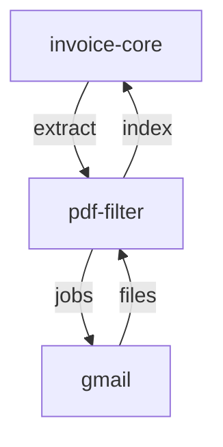

# E-mail Melléklet Letöltő Mikroszerviz - Specifikáció

> 🔗 **Hívási Lánc**: [[invoice-file-filter-spec.md|← PDF Feldolgozó]]

> 📄 **Implementáció**: [attachment-downloader/README.md](../attachment-downloader/README.md)

---

## Szerepkör és kontextus
Te egy Email Integrációs Mérnök vagy. A feladatod e-mail API-n keresztül biztonságosan letölteni és szervezni a számlakonnektált PDF mellékleteket. Ez a szolgáltatás a Tiro rendszer adatgyűjtési végpontjaként működik, amely automatizálja a bejövő dokumentumok feldolgozásának kezdetét és gondoskodik az adatok szabványosított kezeléséről.

A szolgáltatás több e-mail szolgáltatót támogat (provider architektúra). Jelenleg megvalósított: **Gmail** (Google OAuth2). Az architektúra lehetővé teszi további szolgáltatók (pl. Outlook/Microsoft Graph) egyszerű hozzáadását.

## Funkció
E-mail levelekből PDF mellékleteket letölt és ment szabványosított fájlnév-konvencióval, a kiválasztott e-mail szolgáltatón keresztül. A letöltési eredményeket memóriában cache-eli `(start_date, end_date, output_dir)` kulcs alapján, `CACHE_TTL_SECONDS` ideig (default 3600 mp); cache találat esetén nem kérdezi le újra a szolgáltatót. A REST API végpontjai JWT-vel védettek, kivéve a `GET /health`-et.

## Request paraméterek
- `start_date` (YYYY-MM-DD, kötelező) - szűrés kezdete; formátum validálva
- `end_date` (YYYY-MM-DD, kötelező) - szűrés vége (inkluzív); formátum validálva, nem lehet korábbi, mint `start_date` (hiba esetén 400)
- `output_dir` (optional) - alkönyvtár a `DOWNLOAD_ROOT_DIR` alatt (default: a gyökér maga)
- `provider` (query paraméter, default: `gmail`) - e-mail szolgáltató azonosítója

## Fájlnév formátum
`YYYY-MM-DD_NNNN_<sanitizált_eredeti_fájlnév>.pdf`
- `YYYY-MM-DD` = az e-mail dátuma (a Gmail `internalDate` helyi időzónára konvertálva)
- `NNNN` = éves folyamatos sorrendi szám (0001-től); futások között az `output_dir`-ban található legnagyobb sorszámról folytatódik, évváltáskor nullázódik
- Sanitizálás: NFKD normalizálás, `[^A-Za-z0-9._-]` karakterek `_`-re cserélése; ha hiányzik, `.pdf` utótag kerül hozzá

Már letöltött fájlok (sanitizált fájlnév + méret egyezés, a sorszám figyelmen kívül hagyva) újra letöltés nélkül kihagyásra kerülnek. Ha a Gmail nem ad meg méretet (0), a fájl mindig újra letöltődik.

## Interface
- **CLI** (script neve: `attachment-downloader`, `download` alparanccsal):
  ```
  attachment-downloader download --start 2026-05-01 --end 2026-05-31
  attachment-downloader download --start 2026-05-01 --end 2026-05-31 --output invoices
  attachment-downloader download --start 2026-05-01 --end 2026-05-31 --provider gmail
  ```
  Az eredmény rich táblázatban jelenik meg (fájl, eredeti név, e-mail dátum, méret); hiba esetén `typer.Exit(code=1)`.
- **REST API** (port 8000, szinkron — blokkoló hívás, visszaadja az eredményt; minden végpont JWT-védett, kivéve a `/health`-et):
  - `GET /health` - health check (`{"status": "ok", "timestamp": ...}`)
  - `POST /api/v1/jobs?provider=gmail` - letöltés indítása (szinkron)
  - `GET /api/v1/cache` - cache statisztika (entries, hits, misses)
  - `DELETE /api/v1/cache` - cache törlése (204 No Content)

## Autentikáció (JWT)
A REST API végpontjai (a `GET /health` kivételével) JWT-vel védettek, ha `AUTH_ENABLED=true` (a kód defaultja; a gyökér `.env`-ben `ATTACHMENT_DOWNLOADER_AUTH_ENABLED=false` — ez az egyetlen szolgáltatás, amelyet az `invoice-core sync` token nélkül ér el). A token a központi **auth** szerviztől (:8007) származik Google belépés után; `Authorization: Bearer <token>` fejlécben vagy `mp_access_token` HttpOnly cookie-ban érkezhet. A validáció lokális, a JWKS publikus kulcsokkal (RS256, `aud=tiro`, `iss=auth-service`, `typ=access`), nincs kérésenkénti hálózati hívás az auth szerviz felé. Token nélkül `401 Unauthorized`, a JWKS elérhetetlensége esetén `503`. Implementáció: `src/attachment_downloader/auth.py` · spec: [[auth-service-spec.md|Auth Service Spec]]

## Tech stack
- Python 3.11+ (uv monorepo, `pyproject.toml`)
- FastAPI, Typer, Pydantic v2, pydantic-settings, rich
- **Gmail provider**: google-api-python-client, google-auth-oauthlib (kötelező függőség, nem extra)
- JWT validáció: PyJWT (`[crypto]` extra), certifi
- Provider interface: `EmailClient` Protocol (`base.py`) + `get_client(provider, settings)` factory

## Függőségek
- E-mail szolgáltató hitelesítő adatok (Gmail: `GOOGLE_CREDENTIALS_FILE` / `credentials.json` + `GOOGLE_TOKEN_FILE` / `token.json`; a token az első autentikációkor jön létre böngészős OAuth flow-val, 8888-as porton)
- Központi auth szerviz (:8007) JWKS végpontja, ha `AUTH_ENABLED=true`
- Helyi fájlrendszer írási jog

## Konfiguráció (env var-ok)
A beállítások a közös gyökér `.env` fájlból töltődnek (pydantic-settings).

| Változó | Default | Leírás |
|---------|---------|--------|
| `GOOGLE_CREDENTIALS_FILE` | `credentials.json` | OAuth2 Desktop kliens JSON elérési útja |
| `GOOGLE_TOKEN_FILE` | `token.json` | Generált token fájl (első auth-kor jön létre) |
| `DOWNLOAD_ROOT_DIR` | `downloads` | Letöltési gyökérmappa (a projekt gyökeréhez relatív) |
| `CACHE_TTL_SECONDS` | `3600` | Eredmény-cache TTL másodpercben |
| `LOG_LEVEL` | `INFO` | Naplózási szint (`DEBUG`/`INFO`/`WARNING`/`ERROR`) |
| `API_HOST` | `0.0.0.0` | FastAPI bind cím |
| `API_PORT` | `8000` | FastAPI port (alias: `ATTACHMENT_DOWNLOADER_API_PORT`) |
| `AUTH_ENABLED` | `true` | JWT validáció ki/bekapcsolása (itt `ATTACHMENT_DOWNLOADER_AUTH_ENABLED` felülbírálható; a gyökér `.env`-ben `false`) |
| `AUTH_SERVICE_URL` | `http://localhost:8007` | Központi auth szerviz base URL (JWKS) |

A naplók stdout-ra és a `logs/attachment-downloader.log` fájlba íródnak; ha az `output_dir` nem létezik, a cache törlődik és a mappa létrejön.

## Provider architektúra

```
src/attachment_downloader/
├── base.py              # EmailClient Protocol — provider interfész
├── config.py            # Pydantic Settings (env var-ok) + configure_logging()
├── models.py            # Pydantic modellek (DownloadRequest, DownloadResult, CacheInfo)
├── cache.py             # Thread-safe TTL cache
├── utils.py             # sanitize_filename(), scan_output()
├── auth.py              # JWT validálás a központi auth szerviz JWKS kulcsaival
├── providers/
│   ├── __init__.py      # get_client(provider, settings) factory
│   └── gmail/
│       └── client.py    # GmailClient — Google OAuth2 + Gmail API v1
├── cli/main.py          # Typer CLI
└── api/main.py          # FastAPI app
```

Új provider hozzáadásához: `providers/<nev>/client.py` létrehozása `download_pdf_attachments()` metódussal, majd regisztráció a `get_client()` factory-ban.

---

## Kapcsolódások

### Hívási sorrend



### Wiki linkek
- **Prompt**: [[attachment-downloader-prompt.md|Attachment Downloader Prompt]]
- **Meghívva**: [[invoice-file-filter-spec.md|PDF Feldolgozó Spec]]
- **Lánc elődje**: [[nav-invoice-spec.md|NAV Invoice Spec]]
- **MASTER Orchestrator**: [[invoice-core-spec.md|Invoice-Core Spec]]
- **Projekt Index**: [[INDEX.md|Tiro - Mikorszervízek Indexe]]
