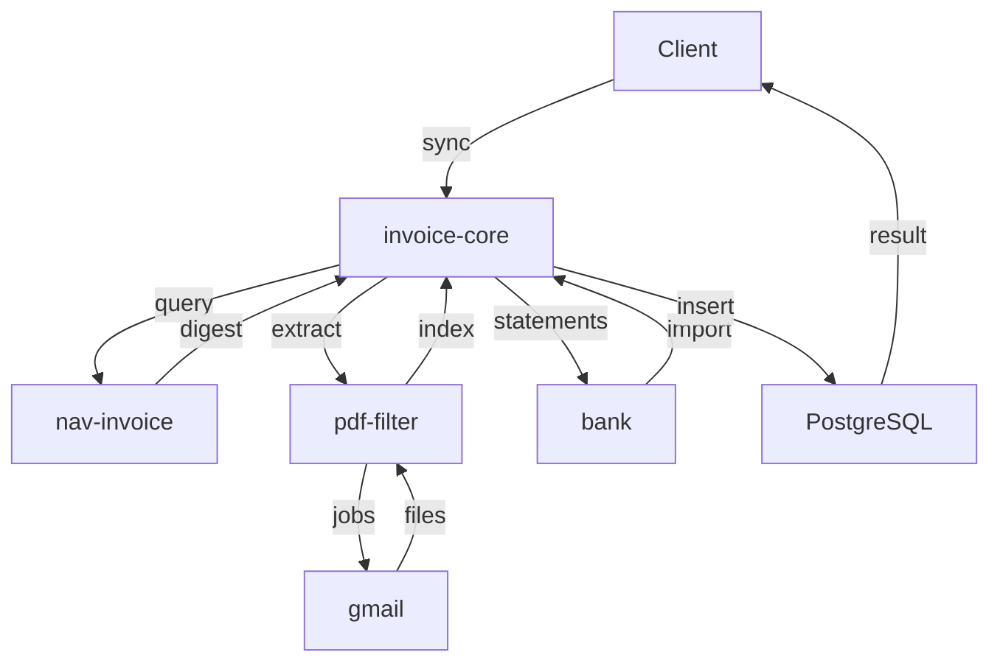

# Számla Adatbázis Mikroszerviz - Specifikáció

> 🔗 **Hívási Lánc**: **←** [[nav-invoice-spec.md|NAV API]]

---

## Szerepkör és kontextus
Te egy Backend Orchestrációs Mérnök vagy. A feladatod a Tiro automata számlázási rendszer szíveként koordináld a mikroszervizek összes interakcióját. Ez a szolgáltatás a kritikus adatbázis hub, amely garantálja a szállító, vevő és számlainformációk konzisztenciáját a teljes rendszerben, biztosítva az idempotenciát és az adatintegritást.

> **Architektúra (2026-06-22)**: Az invoice-core **tiszta JSON REST backend**. Nem kezel UI-t, nem rendel Jinja2 sablonokat. Az összes webes felület a [[vision-spec.md|vision]] (port 8009) szervizben él, amely az itt leírt REST API-t fogyasztja. CORS engedélyezve `http://localhost:8009` (vision) számára.

## Funkció (MASTER HUB)
- **Meghívja: nav-invoice** (NAV lekérdezés — csak a NAV API-t hívja)
- **Meghívja: invoice-file-filter** (PDF feldolgozás — az meghívja attachment-downloadert)
- **Meghívja: bank** (banki tranzakciók lekérése — Erste + Wise CSV, port 8005)
- Vevő és szállító táblákhoz nav-invoice adatai alapján összekapcsolást végez (a sync soha nem hoz létre új partnert — csak kézi felvitel, lásd lentebb)
- invoice-file-filter visszaadott adatait külön `invoice_file` táblában tárolja
- `invoice_file` rekordokat összeköti az `invoice` táblával (words-alapú számlaszám egyezés)
- bank tranzakciókat `bank_transaction` táblában tárolja, összeköti `supplier`/`customer`/`invoice` táblákkal
- Teljes invoice-supplier-customer-bank_transaction összekapcsolás

## Request paraméterek
- `start_date` (optional) - szűrés kezdete (default: 30 nappal ezelőtt)
- `end_date` (optional) - szűrés vége (default: ma)
- `sync_mode` (optional) - sync típusa (full|nav_only|pdf_only|bank_only|match_only)

## Táblák
### invoice (számlák)
- id (PK)
- invoice_number (nav_invoice-tól, egyedi)
- invoice_date
- supplier_id (FK → supplier, **nullable** — lásd "Partner párosítás" lentebb)
- customer_id (FK → customer, **nullable**)
- amount_net, amount_vat, amount_total
- payment_status (PAID|UNPAID|PARTIAL)
- direction (INBOUND|OUTBOUND)
- currency, invoice_operation, invoice_category
- nav_ins_date (NAV bejegyzés ideje; a korábbi `nav_transaction_id` átnevezve)
- payment_method, payment_due_date
- invoice_file_id (FK → invoice_file, nullable: ha nincs PDF egyezés)
- invoice_file_locked (bool — kézi PDF link védelme)
- note (szabad szöveges megjegyzés)
- payment_status_locked (bool — kézi fizetési státusz védelme)
- supplier_locked, customer_locked (bool — kézi partner-kapcsolat védelme, lásd "Partner párosítás")
- created_at, updated_at

### invoice_detail / invoice_line / invoice_vat_summary (NAV teljes számla-részlet)

A `sync_nav` a `queryInvoiceDigest` mellett (bounded, csak új/hiányos soroknál — lásd
`invoice-core/README.md` "Alembic migrations" / sync logika) lekéri a NAV
`queryInvoiceData` teljes választ is, és három táblába menti:

- **`invoice_detail`** (1:1 az `invoice`-val): `raw_xml` (teljes NAV válasz),
  `invoice_category`, `delivery_date`, `currency_code`, `exchange_rate`,
  `invoice_appearance`, `invoice_net_amount`/`invoice_vat_amount`/`invoice_gross_amount`.
  Emellett egy **partner snapshotot** is tárol a NAV digest alapján
  (`supplier_name`/`supplier_tax_number`/`supplier_address`/`supplier_bank_account`,
  `customer_*` megfelelők), **függetlenül** attól, hogy sikerült-e helyi
  `supplier`/`customer` sorral párosítani — ez minden sync futáskor frissül,
  még akkor is, ha a teljes detail-lekérés ki lett hagyva. Így egy párosítatlan
  számlánál is pontosan látszik, kit kell létrehozni/kapcsolni (lásd lentebb és
  "Partner párosítás").
- **`invoice_line`**: soronkénti tételek (`line_number`, `line_description`,
  `quantity`, `unit_of_measure`, `unit_price`, `line_net_amount`, `line_vat_rate`,
  `line_vat_amount`, `line_gross_amount`) — minden enrichment lekéréskor
  törölve és újra beszúrva (a NAV adat számlaszámonként megváltoztathatatlan,
  lásd a "Logika" szakaszt).
- **`invoice_vat_summary`**: ÁFA-kulcsonkénti összesítő sorok (`vat_rate`,
  `vat_rate_net_amount`, `vat_rate_vat_amount`) — ugyanúgy cserélve.

`GET /api/v1/invoices/{id:int}` a `detail` (raw_xml nélkül), `lines` és
`vat_summary` mezőkben adja vissza — ezt a [[vision-spec.md|vision]] számla
részlet oldala (`/ui/invoices/{id}`) jeleníti meg.

### invoice_file (invoice-file-filter visszaadott adatok)
- id (PK)
- filename (egyedi)
- path (a PDF elérési útja)
- file_size
- words (a PDF szövegindexe — `POST /api/v1/pdf/words` hívással töltődik fel
  linkeléskor, lásd "Logika")
- preview_base64 (első oldal képelőnézete)
- is_deleted (bool — soft delete, `PATCH /api/v1/invoice-files/{id}`)
- created_at, updated_at

### supplier (szállítók)
- id (PK)
- name
- tax_id (nullable, egyedi — lásd "Partner párosítás" lentebb)
- address, email, phone
- iban, bban
- bank_accounts (vesszővel elválasztott lista — minden bankszámla, amiről a bank
  szinkron látta fizetni; lásd "Partner párosítás" lentebb)
- known_names (vesszővel elválasztott lista — minden counterparty név, amin a
  partnerhez már kapcsoltak tranzakciót; lásd "Partner párosítás" lentebb)
- created_at, updated_at

Szállító kétféleképpen keletkezik: **automatikusan** a NAV szinkron során (ha
`tax_id` vagy név alapján egyezik egy meglévő sorral, vagy a find-or-create
létrehozza — lásd "Partner párosítás" lentebb), vagy **kézzel**, a
`POST /api/v1/partners/suppliers` végponton / a [[vision-spec.md|vision]]
`/ui/suppliers` "Új szállító" modaljában keresztül — pl. azért, hogy egy
partnerrel már tervezhessünk, mielőtt bármilyen számla vagy banki tranzakció
megérkezne róla.

### customer (vevők)
- id (PK)
- name
- tax_id (nullable, egyedi)
- address, email, phone
- payment_terms
- iban, bban
- bank_accounts (vesszővel elválasztott lista — lásd supplier)
- known_names (vesszővel elválasztott lista — lásd supplier)
- created_at, updated_at

Ugyanaz a kézi létrehozás/módosítás/törlés érvényes rá, mint a szállítóra
(`POST`/`PUT`/`DELETE /api/v1/partners/customers`).

### Partner párosítás (auto-create, tanuló matching)

**Fontos változás (2026-07-26)**: a korábbi „nincs auto-create" szabály megszűnt — a
sync **létrehoz** hiányzó partnert, de csak akkor, ha a NAV/bank adat tényleges
azonosító adatot adott (adószám vagy név); teljesen azonosítatlan rekordnál továbbra
is csak figyelmeztet, és link nélkül hagyja a számlát/tranzakciót. A duplikátum-
védelem mostantól a **többlépcsős keresésben** van (normalizált adószám-mag, kis-
nagybetűtől független névegyezés, `known_names`/`bank_accounts`), nem pedig a
létrehozás tiltásában:

- **NAV szinkron (`sync_nav`)** — `_find_or_create_supplier`/`_find_or_create_customer`:
  először `tax_id` szerint keres (pontos egyezés, majd normalizált 8 jegyű adószám-mag,
  hogy az eltérő kötőjel-formázás/VAT-kód-utótag ne hozzon duplikátumot); ha nincs
  találat, kis-nagybetűtől független névegyezést próbál minden olyan sorral szemben,
  amelynek `tax_id`-ja `NULL` (kézzel felvett placeholder), és visszatölti rá a
  `tax_id`-t. Ha így sem talál egyezést, **új sort hoz létre**, amennyiben a digest
  tartalmazott adószámot vagy nevet (egyiket sem tartalmazó digest esetén a számla
  az adatbázisba **akkor is bekerül**, csak `supplier_id`/`customer_id` marad `NULL`,
  és figyelmeztetés kerül a sync futás `warnings` listájába — pl. *"Számla INV-100:
  ismeretlen szállító 'ACME Kft' (adószám: 12345678-1-42) — hozza létre a Szállítók
  oldalon"*). Meglévő sor esetén a match **csak kiegészít**: a kézzel beállított
  mezőket nem írja felül, csak az üresen hagyottakat tölti fel a NAV adatból.
- **Bank szinkron (`sync_bank`)** — irány alapú partner-keresés (CREDIT → vevő,
  minden más → szállító), ebben a sorrendben:
  1. ismert bankszámla/IBAN egyezés (`iban`/`bban`, majd a felhalmozott
     `bank_accounts` lista — a partner akár olyan számláról is fizethet, amit a NAV
     sosem jelentett),
  2. pontos `counterparty_name` egyezés,
  3. korábban **megerősített** név (`known_names` — kézi linkelés vagy korábbi sync
     által rögzítve),
  4. utolsó mentsvárként **új partner létrehozása** a `counterparty_name`-ből.
  Emellett a banki díj/kamat tranzakciókhoz szintetikus „bank" szállítókat
  (`bank_supplier_names` konfig), az adóhatósági kifizetésekhez pedig szintetikus
  „NAV ÁFA"/„NAV TAO"/„HIPA" stb. szállítókat (`tax_accounts` konfig) hoz létre
  automatikusan. A sikeres kapcsolás mindig rögzíti a partnernél a megfigyelt
  számlaszámot és nevet (`bank_accounts`, `known_names`) — így egy rövidített/
  elgépelt partner-név is felismerhető a következő sync-en.
- **Öngyógyulás**: ha a hiányzó partner időközben létrejön (kézzel, vagy egy
  következő NAV digest/bank tranzakció létrehozza), a következő sync futás
  automatikusan összekapcsolja a korábban függőben lévő számlát/tranzakciót — nincs
  szükség manuális újra-linkelésre. Ez **kimarad**, ha a felhasználó már kézzel
  beállította vagy törölte az adott mezőt (lásd `supplier_locked`/
  `customer_locked` lentebb).
- **Láthatóság**: `GET /api/v1/sync/pending` visszaadja, hány számla/tranzakció
  vár még párosításra — ez független az utolsó futás átmeneti figyelmeztetéseitől,
  és ezt olvassa a [[vision-spec.md|vision]] Sync oldalának állandó "függőben lévő
  párosítás" kártyája.
- **Kézi kapcsolás/leválasztás — zárolással (`supplier_locked` /
  `customer_locked`, 2026-07-23-tól)**: `PUT`/`DELETE /api/v1/invoices/{id}/supplier`
  és `/customer`, valamint `PUT`/`DELETE /api/v1/transactions/{id}/supplier` és
  `/customer`. Az `invoice` és a `bank_transaction` tábla két bool mezőt kapott
  (`supplier_locked`, `customer_locked`, alapértelmezett `False`), amelyeket a
  fenti négy végpont **mindkét iránya** (kapcsolás *és* leválasztás) `True`-ra
  állít. A sync minden automatikus lépése (`sync_nav` öngyógyulás, `sync_bank`
  számla-alapú levezetés/névegyezés/bank-díj heurisztika, `sync_match`
  szállító+összeg egyeztetés és a végső backfill) kihagyja azt a mezőt, amelyiken
  a megfelelő lock `True` — így egy kézi "nincs itt partner" döntés éppúgy
  megmarad újraszinkronizálás után, mint egy kézi "ez a partner" döntés. Ez
  szándékosan eltér az `invoice_file_id`/`invoice_file_locked` PDF-linktől
  (`invoice-core link`/`link-bank` CLI, illetve `PUT`/`DELETE
  /api/v1/invoices|transactions/{id}/invoice-file` — részletek:
  `invoice-core/README.md` "Manual linking"), ahol a leválasztás feloldja a
  zárolást — itt a leválasztás **is** zárol, mert egy explicit "nincs partner"
  döntést a sync ugyanúgy nem írhat felül, mint egy konkrét partner-választást.
  A [[vision-spec.md|vision]] számla részlet oldala ezt egy picker modallal
  (`GET /ui/picker/partners?kind=supplier|customer&invoice_id=`) és egy beágyazott
  "új partner létrehozása és kapcsolása" mini-formmal érvényesíti, amely az
  `invoice_detail` partner snapshotjából (fenti) előtölti a név/adószám/cím/
  bankszámla mezőket — ez a leggyakoribb eset egyenes megoldása, amikor a számla
  olyan partnerre hivatkozik, ami helyben még nem létezik.

### bank_transaction (banki tranzakciók — Erste + Wise)
- id (PK)
- bank (str: "erste" | "wise")
- transaction_id (külső azonosító, idempotencia, egyedi)
- amount (abszolút érték)
- currency
- direction ("CREDIT" | "DEBIT")
- transaction_date
- description
- payment_reference
- counterparty_name
- counterparty_account
- counterparty_iban
- counterparty_address, sender_address, counterparty_bank_code (későbbi re-exportból visszatöltve)
- transaction_type
- category
- balance
- fees
- exchange_rate, exchange_to_currency (FX tranzakcióknál)
- card_last_four (kártyás tranzakcióknál)
- note (szabad szöveges megjegyzés)
- supplier_id (FK → supplier, nullable)
- customer_id (FK → customer, nullable)
- invoice_file_id (FK → invoice_file, nullable)
- invoice_file_locked, supplier_locked, customer_locked (bool — kézi link védelme)
- created_at, updated_at

A számla-kapcsolat **many-to-many** a `invoice_bank_transaction` junction
táblán keresztül (`invoice_id`, `bank_transaction_id`, `manual` bool — a kézi
`PUT`/`DELETE /api/v1/invoices/{id}/transactions/{txn_id}` linkeket jelöli) —
nem `invoice_id` FK a `bank_transaction`-on, mert egy tranzakció több számlát
is kiegyenlíthet. A `GET /api/v1/transactions` az irány szerint dönti el, melyik
partnert adja vissza megjelenítésre: `DEBIT` (kimenő) esetén a kapcsolt
`supplier`-t, `CREDIT` (bejövő) esetén a kapcsolt `customer`-t — a
[[vision-spec.md|vision]] tranzakció táblája ez alapján linkel a megfelelő
szállító/vevő oldalra, és "nincs partner" jelzést ad, ha egyik sincs kapcsolva
(a nyers `counterparty_name`-re már nem esik vissza).

### user (login rekordok az auth szervizből)
- id (PK)
- provider (str: "google")
- sub (provider-beli user id)
- email
- name (nullable)
- picture (avatar URL, nullable)
- created_at, updated_at, last_login_at
- egyedi kulcs: (provider, sub)

Az `auth` szerviznek (:8007) nincs saját adatbázisa — minden sikeres bejelentkezéskor
best-effort POST-olja a felhasználó profilját és a login providert ide (`POST
/api/v1/users`), a frissen kiállított access tokennel. Ez az egyetlen tábla,
amit nem a sync pipeline tölt fel, hanem egy másik szerviz push-olja. A
`last_login_at` emellett **minden hitelesített API kérésre** frissül (best-effort,
60 másodpercenként maximum egyszer felhasználónként — `touch_last_login`), így az
"Utolsó belépés" az utolsó aktivitást tükrözi, nem csak az OAuth login pillanatát.

### audit_log (admin audit — felhasználói módosítások naplója)
- id (PK)
- user_email (a módosítást végző felhasználó)
- impersonator_email (nullable — támogatói megszemélyesítéskor a rendszergazda,
  aki a felhasználó nevében járt el; a JWT `impersonator_email` claim-jéből)
- method (POST|PUT|PATCH|DELETE)
- path
- page (magyar menü-címke: Számlák, Bank, Szállítók, Vevők, Tevékenység típusok,
  Projektek, Timesheet — útvonal-prefix alapján)
- record (emberi olvasású rekord-azonosító: számlaszám, partner név, projekt kód…)
- label (nullable — a UI által küldött `X-Audit-Label` fejléc, azaz a kattintott
  gomb/akció neve, percent-encoded)
- action (create|update|delete)
- changes (nullable JSON — update műveleteknél `[{"field", "old", "new"}, ...]`
  mező-szintű különbséglista, lásd "Audit log" lentebb)
- status_code
- created_at

Minden sikeres (2xx) felhasználói módosítást naplóz egy middleware
(`record_audit_log`): a `record`-ot **a módosítás előtt** oldja fel (DELETE után
a sor már nem létezne), create műveleteknél a válasz body-jából olvassa ki az új
rekord id-ját (`extract_created_id`), update-nél pedig előtte/utána snapshotot
készít és mező-szintű diffet számol a `changes` oszlopba. A GET kérések, a
`/api/v1/sync*` (amit a SyncLog külön naplóz) és a `/api/v1/users` (rendszer-
generált login upsert) soha nem kerülnek auditálásra. A megszemélyesítés
(impersonation) az auth szervizben történik, de az itt tárolt
`impersonator_email` mutatja, ha egy rendszergazda egy másik felhasználó nevében
módosított — lásd `GET /api/v1/audit-log` a REST táblában.

### activity_type (admin törzsadat — timesheet funkcióhoz)
- id (PK)
- name (egyedi)
- is_active (bool, default: true) — inaktív típus új rekordhoz nem választható, meglévő rekordok érintetlenek
- created_at, updated_at

Admin CRUD törzsadat a [[vision-spec.md|vision]] `/ui/admin/activity-types` oldalához.
Törlés (`DELETE`) csak a UI oldalán van feltételhez kötve (csak ha a használati szám
0) — de ez a `usage_count` a UI-n egyelőre `0` placeholder, nincs még
`timesheet_entry`-hez kötve. A szerver oldali `create_timesheet_entry` viszont
már megköveteli, hogy a hivatkozott `activity_type` létezzen és `is_active` legyen.

### project (Controlling törzsadat — projektek)
- id (PK)
- customer_id (FK → customer)
- sequence_no (int) — ügyfelenként növekvő, szerver számítja
- short_name (str)
- code (egyedi, szerver komponálja: `{short_name}-{sequence_no:03d}`)
- owner_id (FK → user) — project gazda
- status (OPEN|CLOSED|ONHOLD, default: OPEN) — csak nyitott projektre
  rögzíthető új idő (a korábbi `is_active` bool helyett, 2026-07-27-től)
- start_date (dátum, kötelező) — a projekt kezdő dátuma; a timesheet
  `entry_date` nem lehet korábbi nála (lásd lentebb)
- project_type (OTLET|SZAMLAZHATO|PRESALES, default: SZAMLAZHATO)
- created_at, updated_at

### project_permitted_user (junction — projekt ↔ user)
- project_id (FK → project)
- user_id (FK → user)

Ki jogosult timesheet rekordot rögzíteni az adott projekthez — a
`timesheet_service` ténylegesen ellenőrzi ezt `create`/`update` híváskor (a
`project.owner_id` vagy a `permitted_user_ids` tagja lehet csak). Admin CRUD a
[[vision-spec.md|vision]] `/ui/controlling/projects` oldalán: ügyfél és project
gazda kiválasztás legördülőből (valós `customer`/`user` adat), sorszám és
project kód kliens-oldali előnézete van, de a szerver a végső forrás — mindkettő
`create`/`update` híváskor újraszámolódik. A `sequence_no` csak akkor kap új
értéket módosításnál, ha az `customer_id` megváltozik. Az "Összesített
ráfordítás (óra)" oszlop a `usage_hours` property-ből jön (a projekt
`timesheet_entry`-jeinek óraösszege), az `first_entry_date` pedig a legelső
rögzített bejegyzés dátuma — mindkettőt a `ProjectOut` visszaadja.

### timesheet_entry (Controlling — munkaidő rögzítés)
- id (PK)
- user_id (FK → user) — ki rögzítette a bejegyzést
- project_id (FK → project)
- activity_type_id (FK → activity_type)
- entry_date (dátum)
- hours (float) — pozitív, 0,5 órás lépésekben (`_validate_hours` ellenőrzi)
- participants (str, opcionális, szabad szöveg) — szándékosan nem `user` FK/M2M,
  mert az ügyfél-oldali résztvevők nem feltétlenül szerepelnek a `user` táblában
- description (str, opcionális, szabad szöveges leírás)
- created_at, updated_at

`project_week` nincs tárolva — szerver-számított property, amely **naptári
heteken** (hétfő-vasárnap) számol, és a projekt **első rögzített bejegyzésére**
horgonyoz (`project.first_entry_date`, vagy ha még nincs bejegyzés, a
`project.created_at` dátumára; 2026-07-27-től — korábban a `project.created_at`
volt az implicit "W1" horgony és hetente 7 napot számolt, mostantól a hétfői
napok különbsége adja a hét sorszámát: `(entry_monday - anchor_monday).days // 7
+ 1`). Létrehozás/módosítás előtt a `timesheet_service` ellenőrzi: a projekt
létezik és **nyitott** (`status == OPEN`), a `user_id` jogosult rá (gazda vagy
`permitted_user_ids` tagja), a `activity_type` létezik és aktív, az `entry_date`
**nem korábbi a projekt `start_date`-jénél** (2026-07-31-től), és az órák pozitív
0,5-lépésű értékek — mindegyik szabálysértés `409`-et ad. Listázás opcionálisan
`user_id` szerint szűrhető (2026-07-27-től a paraméter már nem kötelező — a
riportoldal így kérheti le egy felhasználó adatait is); módosítás/törlés
továbbra is kötelező `user_id` query paraméterrel megy (más felhasználó rekordja
"nem található"-ként `404`-et ad, nem `403`-at, hogy ne szivárogtasson létezési
infót). Admin CRUD a [[vision-spec.md|vision]] `/ui/controlling/timesheet`
oldalán. A mockupban szereplő "Zárolás" (heti zárolás) funkció **egyelőre nincs
implementálva** — nincs admin/role fogalom a `user` táblán, ezért ez a UI-n
látható, de letiltott gomb marad, amíg a szerepkör-modell meg nem érkezik.

A `report_service` a `timesheet_entry` táblát **felhasználói szűrés nélkül**,
minden felhasználó bejegyzésén olvassa (a `/api/v1/reports/timesheet`
végpont mögött) — ez szándékos eltérés a fenti saját-rekord CRUD-tól, mivel a
[[vision-spec.md|vision]] `/ui/controlling/reports` riportoldala az összes
felhasználó munkaidejét összesíti. Nincs admin/role ellenőrzés itt sem
(ugyanaz a hiányzó szerepkör-modell), tehát bármely bejelentkezett felhasználó
lekérdezheti bárki óráit. A csoportosítás/pivot Python oldalon történik (nem
SQL `GROUP BY`), hogy SQLite alatt (tesztek) és PostgreSQL alatt (production)
egyaránt ugyanúgy működjön — ugyanaz a minta, mint a `tax_service`-nél.

`report_type=person|customer|activity_type` esetén a `GroupReport` a
csoportosított totálok (`rows`: `key_label`, `total_hours`, `entry_count`,
tevékenység-típusonkénti pivot) mellett egy `entries` listát is visszaad —
egy sor minden egyes `timesheet_entry`-re (dátum, magyar hét napja,
`project_week`, projekt kód, ügyfél név, felhasználó név, tevékenység típus
név, résztvevők, **leírás** — 2026-07-26-tól —, órák), a csoport címke majd
dátum szerint rendezve. A [[vision-spec.md|vision]] riportoldal ezt használja a
részletes soronkénti listázáshoz, a `rows`-t pedig az alatta megjelenő
Összesítés szekcióhoz.

## Logika (Orchestration)
1. **invoice-core iniciál** → sorban:
   - **nav-invoice** meghívása (GET /invoices?from_date=...&to_date=...&direction=...)
     - nav-invoice csak a NAV API-t hívja, visszaad: számlalista, supplier/customer adatok
   - **invoice-file-filter** meghívása (POST /api/v1/invoices/extract)
     - invoice-file-filter meghívja attachment-downloadert (Gmail PDF letöltés)
     - visszaad: letöltött PDF fájlok listája (filename, path, file_size, preview_base64)
2. **Merge** (PDF ↔ NAV számla):
   - Minden link nélküli NAV számlához: előbb **fájlnév-egyezés** (a számlaszám a
     fájlnévben), ha az nem talál, **word-keresés** (`POST /api/v1/pdf/words` — a
     PDF szövegindexében szerepel-e a számlaszám); az eredmény az
     `invoice_file.words` oszlopban cache-elődik
   - Egyezés esetén az `invoice_file_id` FK-t állítja be a NAV rekordon
3. **DB mentés**:
   - `invoice_file`: invoice-file-filter nyers visszaadott adatai (minden PDF rekord)
   - `supplier` / `customer`: partner adatok (nav-invoice alapján, find-or-create —
     lásd "Partner párosítás")
   - `invoice`: NAV számlák, `invoice_file_id` FK-val ha volt PDF-egyezés
4. **Bank szinkron** (független a NAV/PDF ágaktól):
   - **bank** meghívása: `GET /balance-statement/all` (paraméter nélkül)
     → visszaad: `ConsolidatedStatement` — Erste + Wise CSV tranzakciók
   - `bank_transaction` mentése (idempotens: `transaction_id` duplikátum-ellenőrzés)
   - `supplier` / `customer` összekapcsolás irány alapú partner-kereséssel
     (bankszámla/IBAN → név → `known_names` → új partner; lásd "Partner párosítás")
   - `invoice_id` összekapcsolás `payment_reference` alapján (ha van egyező NAV számla)
   - adóhatósági/banki díj tranzakciók a szintetikus NAV/bank szállítókhoz kötve
5. **`sync_match`** (a bank ↔ PDF irány):
   - tranzitív rövidzár: ha a tranzakcióhoz már van számla, és ahhoz PDF, azt örökli
   - hivatkozás-alapú: számjegyet tartalmazó `payment_reference`-hez a PDF-nek
     *tartalmaznia* kell a hivatkozást (különben link nélkül marad)
   - szállító+összeg egyeztetés hivatkozás nélküli tranzakciókra
   - pontozott (vendor név + összeg + dátum közelség) greedy hozzárendelés
   - végső backfill: a közös `invoice_file_id`-n keresztül a tranzakció
     visszalinkelődik a számlához, és a `supplier_id`/`customer_id` is visszatöltődik
     a számláról (a lock-olt mezőket kihagyva)
6. **Konkurencia-védelem**: a `sync_all` egy DB-szintű `sync_lock` soron
   (compare-and-swap `UPDATE ... WHERE`) szerializálja a futásokat — párhuzamos
   második sync `409`-et kap ("Szinkronizálás már folyamatban van..."), a lock
   30 perc után magától lejár (halott folyamat esetén).

## Interface
- **CLI**:
  - `invoice-core sync` - teljes szinkronizálás (NAV + PDF + Bank + Match);
    `--start`/`--end` (dátum), `--clear-cache`, `--json`, `--verbose`, `--token`
    (Bearer token a downstream hívásokhoz — lásd `MP_SERVICE_TOKEN` env var)
  - `invoice-core sync-nav` - NAV adatok szinkronizálása
  - `invoice-core sync-pdf` - PDF adatok szinkronizálása
  - `invoice-core sync-bank` - Bank tranzakciók szinkronizálása
  - `invoice-core sync-match` - Összekapcsolás (PDF ↔ bank tranzakció)
  - `invoice-core report --month 2026-05` - havi szinkron + kimutatás
  - `invoice-core dividend [--year 2026] [--kiva-rate 0.10] [--hipa-rate 0.02]` -
    osztalékelőleg-kalkuláció (a `--kiva-rate` a TAO ráta helyére írható be, mert
    egy cég vagy TAO-t vagy KIVA-t fizet, sosem mindkettőt)
  - `invoice-core link <invoice_number> <filename>` - manuális számla-PDF összekapcsolás
  - `invoice-core link-bank <transaction_id> <filename>` - manuális bank-PDF összekapcsolás
- **REST API** (teljes lista — CORS: `http://localhost:8009`):

| Method | Endpoint | Leírás |
|--------|----------|--------|
| `GET`  | `/health` | Health check (publikus, auth nélkül) |
| `GET`  | `/api/v1/dashboard` | KPI-k, utolsó számlák, tranzakciók, top szállítók **és vevők**, havi pénzügyi bontás, utolsó szinkron |
| `POST` | `/api/v1/sync` | Teljes szinkronizálás (NAV + PDF + Bank + Match); 409 ha már fut egy sync (DB-lock) |
| `POST` | `/api/v1/sync/nav` | NAV szinkronizálás |
| `POST` | `/api/v1/sync/pdf` | PDF szinkronizálás |
| `POST` | `/api/v1/sync/bank` | Bank szinkronizálás |
| `POST` | `/api/v1/sync/match` | Összekapcsolás (PDF ↔ bank) |
| `GET`  | `/api/v1/sync/logs` | Szinkron naplóbejegyzések (`limit` param) |
| `GET`  | `/api/v1/sync/pending` | Hány számla/tranzakció vár még partner-párosításra (`{"unmatched_invoices": n, "unmatched_transactions": n}`) — állandó, nem az utolsó futástól függő érték |
| `GET`  | `/api/v1/audit-log` | Audit napló (szűrés: `user_email`, `page`, `date_from`, `date_to`; `limit` default 200, max 1000) — a [[vision-spec.md|vision]] `/ui/admin/audit` oldal adatforrása |
| `GET`  | `/api/v1/invoices/count` | Számlák száma `{"count": n}` — regisztrálva `/{invoice_number}` előtt |
| `GET`  | `/api/v1/invoices` | Számlalista (szűrés: `date_from`, `date_to`, `status`, `direction`, `has_pdf`, `supplier_name`; `limit`/`offset` lapozás) |
| `GET`  | `/api/v1/invoices/{invoice_id:int}` | Számla részletei (PK alapján, bank tranzakciókkal, `detail`/`lines`/`vat_summary` mezőkkel) |
| `GET`  | `/api/v1/invoices/{invoice_number}` | Számla számlaszám alapján |
| `PATCH`| `/api/v1/invoices/{invoice_id:int}` | Számla részleges módosítása: `note`, `payment_status_locked`, `payment_status` (mindegyik opcionális, csak a küldött mezők érvényesülnek); 404 ha nem létezik, 422 érvénytelen státusznál |
| `GET`  | `/api/v1/invoice-files` | PDF fájl lista (szűrés: `linked=yes/no`, `filename` részlet; `limit`/`offset`) |
| `GET`  | `/api/v1/invoice-files/{file_id:int}/pdf` | PDF fájl kiszolgálása (`FileResponse`) |
| `PATCH`| `/api/v1/invoice-files/{file_id:int}` | PDF soft delete (`is_deleted=true` — a sor és a fájl megmarad, csak eltűnik a listákból); 404 ha nem létezik, 409 ha már törölt |
| `GET`  | `/api/v1/partners/suppliers` | Szállítólista |
| `GET`  | `/api/v1/partners/suppliers/summary` | Szállítói statisztikák — regisztrálva `/{supplier_id:int}` előtt |
| `GET`  | `/api/v1/partners/suppliers/{supplier_id:int}` | Szállító részletei (számláival, tranzakcióival) |
| `POST` | `/api/v1/partners/suppliers` | Szállító kézi létrehozása; 409 ha a `name` vagy `tax_id` már foglalt |
| `PUT`  | `/api/v1/partners/suppliers/{supplier_id:int}` | Szállító módosítása; 404 ha nem létezik, 409 név/adószám ütközésnél |
| `DELETE` | `/api/v1/partners/suppliers/{supplier_id:int}` | Szállító törlése; 404 ha nem létezik, 409 ha van hozzá kapcsolt számla vagy banki tranzakció |
| `GET`  | `/api/v1/partners/customers` | Vevőlista |
| `GET`  | `/api/v1/partners/customers/{customer_id:int}` | Vevő részletei |
| `POST` | `/api/v1/partners/customers` | Vevő kézi létrehozása; 409 ha a `name` vagy `tax_id` már foglalt |
| `PUT`  | `/api/v1/partners/customers/{customer_id:int}` | Vevő módosítása; 404 ha nem létezik, 409 név/adószám ütközésnél |
| `DELETE` | `/api/v1/partners/customers/{customer_id:int}` | Vevő törlése; 404 ha nem létezik, 409 ha van hozzá kapcsolt számla vagy banki tranzakció |
| `GET`  | `/api/v1/transactions` | Bank tranzakció lista (szűrés: `date_from`, `date_to`, `linked`, `partner_name`, `amount_min`, `amount_max`) |
| `GET`  | `/api/v1/transactions/balances` | Legutolsó egyenleg bankonként |
| `GET`  | `/api/v1/transactions/{transaction_id:int}` | Tranzakció részletei |
| `PUT`  | `/api/v1/invoices/{invoice_id}/invoice-file` | Számla ↔ PDF kézi összekapcsolás (`invoice_file_id` body) — `invoice_file_locked=true`; 404 ha a számla/PDF nem létezik |
| `DELETE` | `/api/v1/invoices/{invoice_id}/invoice-file` | Számla ↔ PDF leválasztás (a lock feloldódik); 404 ha a számla nem létezik |
| `PUT`  | `/api/v1/invoices/{invoice_id}/supplier` | Számla ↔ szállító kézi kapcsolás (`supplier_id` body) — `supplier_locked=true`; 404 ha a számla/szállító nem létezik |
| `DELETE` | `/api/v1/invoices/{invoice_id}/supplier` | Számla ↔ szállító leválasztás — **a lock is beáll** (kézi "nincs partner" döntés); 404 ha a számla nem létezik |
| `PUT`  | `/api/v1/invoices/{invoice_id}/customer` | Számla ↔ vevő kézi kapcsolás (`customer_id` body) — `customer_locked=true`; 404 ha a számla/vevő nem létezik |
| `DELETE` | `/api/v1/invoices/{invoice_id}/customer` | Számla ↔ vevő leválasztás — **a lock is beáll**; 404 ha a számla nem létezik |
| `PUT`  | `/api/v1/transactions/{txn_id}/invoice-file` | Tranzakció ↔ PDF kézi összekapcsolás — `invoice_file_locked=true`; 404 ha a tranzakció/PDF nem létezik |
| `DELETE` | `/api/v1/transactions/{txn_id}/invoice-file` | Tranzakció ↔ PDF leválasztás (a lock feloldódik); 404 ha a tranzakció nem létezik |
| `PUT`  | `/api/v1/transactions/{txn_id}/supplier` | Tranzakció ↔ szállító kézi kapcsolás — `supplier_locked=true`, a `counterparty_name` bekerül a szállító `known_names`-ébe; 404 ha nem létezik |
| `DELETE` | `/api/v1/transactions/{txn_id}/supplier` | Tranzakció ↔ szállító leválasztás — **a lock is beáll**; 404 ha a tranzakció nem létezik |
| `PUT`  | `/api/v1/transactions/{txn_id}/customer` | Tranzakció ↔ vevő kézi kapcsolás — `customer_locked=true`, a `counterparty_name` bekerül a vevő `known_names`-ébe; 404 ha nem létezik |
| `DELETE` | `/api/v1/transactions/{txn_id}/customer` | Tranzakció ↔ vevő leválasztás — **a lock is beáll**; 404 ha a tranzakció nem létezik |
| `PUT`  | `/api/v1/invoices/{invoice_id}/transactions/{txn_id}` | Számla ↔ tranzakció M2M kézi kapcsolás (junction `manual=true`), fizetési státusz újraszámolva; 404 ha a számla/tranzakció nem létezik |
| `DELETE` | `/api/v1/invoices/{invoice_id}/transactions/{txn_id}` | Számla ↔ tranzakció M2M leválasztás, fizetési státusz újraszámolva; 404 ha a számla nem létezik |
| `GET`  | `/api/v1/reports/dividend` | Éves osztalék/adó kalkuláció (`year`, `kiva_rate` — TAO ráta helyére, `hipa_rate` paraméterek) |
| `GET`  | `/api/v1/reports/tax` | Adófizetési kimutatás hónap és típus szerint (`year` param; `gross_revenue` = éves beérkező összeg) |
| `GET`  | `/api/v1/reports/tax-estimate` | Havi adó-becslés (`year`, `tao_rate`, `hipa_rate`, `szja_rate`, `szocho_rate` paraméterek) — az aktuális év hátralévő hónapjait a tényleges hónapok átlagával vetíti előre (`is_projected=true` sorok) |
| `POST` | `/api/v1/users` | Login rekord upsert (provider+sub alapján) — az auth szerviz hívja minden sikeres bejelentkezéskor |
| `GET`  | `/api/v1/users` | Bejelentkezett felhasználók listája (utolsó belépés szerint csökkenő) |
| `POST` | `/api/v1/activity-types` | Új tevékenység típus létrehozása (409, ha a név már foglalt — kis-nagybetűtől függetlenül) |
| `GET`  | `/api/v1/activity-types` | Tevékenység típusok listája (név szerint) |
| `PUT`  | `/api/v1/activity-types/{id}` | Tevékenység típus módosítása (név + `is_active`); 404 ha nem létezik, 409 névütközésnél |
| `DELETE` | `/api/v1/activity-types/{id}` | Tevékenység típus végleges törlése; 404 ha nem létezik |
| `POST` | `/api/v1/projects` | Új projekt létrehozása — `customer_id`/`owner_id`/`start_date`/`project_type` megadása kötelező (`status` default OPEN), `sequence_no`/`code` szerver-számított; 409 ha ismeretlen ügyfél/gazda vagy kódütközés |
| `GET`  | `/api/v1/projects` | Projektek listája (`code` szerint), `customer_name`/`owner_name`/`permitted_user_ids`/`usage_hours`/`first_entry_date` kiegészítve |
| `PUT`  | `/api/v1/projects/{id}` | Projekt módosítása (ügyfél, rövid név, gazda, `status`, `start_date`, `project_type`, `permitted_user_ids`); `code` újraszámolva, `sequence_no` csak ügyfélváltáskor; 404 ha nem létezik, 409 kódütközésnél |
| `DELETE` | `/api/v1/projects/{id}` | Projekt végleges törlése; 404 ha nem létezik (meglévő timesheet bejegyzések FK-hibát adnak) |
| `POST` | `/api/v1/timesheet-entries` | Timesheet rekord létrehozása `user_id`-hez; 409 ha ismeretlen projekt/felhasználó/tevékenység típus, nem nyitott vagy nem jogosult projekt, inaktív tevékenység típus, a dátum korábbi a projekt `start_date`-jénél, vagy az órák nem pozitív 0,5-lépésűek |
| `GET`  | `/api/v1/timesheet-entries` | Rekordok listája — `user_id` query **opcionális** (2026-07-27-től: elhagyva mindenki rekordjait adja vissza), `entry_date` majd `id` szerint; minden sor tartalmazza a `project_code`/`customer_name`/`activity_type_name`/`user_name` mezőket és a szerver-számított `project_week`-et |
| `PUT`  | `/api/v1/timesheet-entries/{id}` | Rekord módosítása (kötelező `user_id` query — más felhasználó rekordja 404, nem 403); ugyanaz a validáció mint létrehozásnál |
| `DELETE` | `/api/v1/timesheet-entries/{id}` | Rekord törlése (kötelező `user_id` query); 404 ha nem létezik/nem a sajátja |
| `GET`  | `/api/v1/reports/timesheet` | Timesheet riport — `report_type` (`project`\|`person`\|`customer`\|`activity_type`, kötelező), `date_from`, `date_to`, `customer_id`, `project_id`, `user_id`, `activity_type_id` (mind opcionális); `project_id` kötelező, ha `report_type=project`; 400 ha hiányzik vagy ismeretlen a `report_type` |

## Tech stack
- Python 3.10+
- FastAPI, Typer, SQLAlchemy
- PostgreSQL (vagy SQLite dev)
- Pydantic

## Adatbázis
- PostgreSQL (prod) vagy SQLite (dev)
- Migrációk: Alembic

## Kapcsolódások

### Hívási sorrend

### Wiki linkek
- **Prompt**: [[invoice-core-prompt.md|Invoice-Core Prompt]]
- **MASTER Orchestrator**: Ez a szerviz (tiszta REST backend — UI nincs); az egyetlen szerviz a workspace-ben, aminek saját PostgreSQL adatbázisa van
- **UI**: [[vision-spec.md|Vision Frontend Spec]] — az összes `/ui/*` oldal a vision (8009) szervizben él
- **Hívja (bejövő)**: [[auth-service-spec.md|Auth Spec]] — `POST /api/v1/users` minden sikeres bejelentkezéskor (best-effort, login rekord mentése — auth-nak nincs saját DB-je)
- **Meghívja**: [[nav-invoice-spec.md|NAV Invoice Spec]]
  - NAV lekérdezés: `GET /invoices`, `GET /invoices/{szamlaszam}`
  - 30 nap default paraméterrel
- **Meghívja**: [[invoice-file-filter-spec.md|PDF Feldolgozó Spec]]
  - PDF letöltés + indexelés: `POST /api/v1/invoices/extract`
  - Words keresés: `GET /api/v1/invoices/search?words=<számlaszám>` (melyik PDF fájl tartalmazza a szót)
  - invoice-file-filter maga hívja attachment-downloadert a PDF letöltéshez
- **Meghívja**: [[bank-spec.md|Bank Spec]]
  - `GET /balance-statement/all` (paraméter nélkül) — Erste + Wise CSV konszolidált tranzakciók
  - Levél szolgáltatás — DB-t nem kezel
- **Projekt Index**: [[INDEX.md|Tiro - Mikorszervízek Indexe]]
