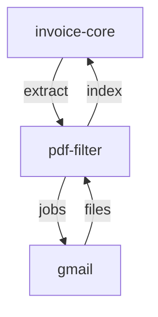

# PDF Számla Feldolgozó Mikroszerviz - Specifikáció

> 🔗 **Hívási Lánc**: [[nav-invoice-spec.md|← NAV API]] **→** [[attachment-downloader-spec.md|Gmail Letöltő →]]

---

## Szerepkör és kontextus
Te egy adatkinyerési szakember (Data Extraction Engineer) vagy. A feladatod a letöltött PDF csatolmányokból kiválogatni a számlákat, és fájl-metaadatokat szolgáltatni róluk. Ez a szolgáltatás a dokumentumtípus-felismerést (kulcsszó-egyezés, OCR fallback) végzi el, és a kiválogatott fájlok listáját szállítja az `invoice-core` orchestratornak, amely a strukturált mezőkinyerést és a NAV adatokkal való összekötést végzi.

## Funkció
- **Meghívja: attachment-downloader** (utolsó 30 nap default)
- Letöltött PDF fájlokból kulcsszó-egyezés alapján kiválogatja a számlákat
- Fájl-metaadatokat szolgáltat (fájlnév, útvonal, módosítási idő, méret, első oldal előnézete)
- Beszkennelt PDF-eknél OCR fallback (Tesseract)
- Meghívott a nav-invoice által

## Kimeneti adatok (ExtractResponse)

A szolgáltatás **nem** nyer ki strukturált számla-mezőket (számlaszám, összeg, TAX ID stb.) — az `invoice-core` feladata. Minden feldolgozott PDF-ről fájl-metaadatot ad vissza:

```json
{
  "total_files": 12,
  "invoice_count": 3,
  "output_dir": "../attachment-downloader/downloads",
  "files": [
    {
      "filename": "2026-05-001_szamla.pdf",
      "path": "/abs/path/2026-05-001_szamla.pdf",
      "modified": "2026-05-01T10:15:00+02:00",
      "file_size": 184320,
      "preview_base64": "..."
    }
  ]
}
```

## Input (opciók)
- `start_date` (optional) - szűrés kezdete (default: 30 nappal ezelőtt)
- `end_date` (optional) - szűrés vége (default: ma)
- `output_dir` (optional) - PDF könyvtár (default: `../attachment-downloader/downloads`)
- `download` (bool, default: true) - letöltés attachment-downloaderrel; `false` esetén a már meglévő PDF-eket dolgozza fel
- Batch feldolgozás: több PDF párhuzamosan, `EXTRACT_WORKERS` szálon

## API hívások
- attachment-downloader API: `POST /api/v1/jobs` (szinkron, `{start_date, end_date}`) → azonnali `DownloadResult` (fájlok + output_dir)
- A beérkező kérés Bearer tokenjét továbbadja (token passthrough)
- A letöltött fájlok `saved_path` listáját dolgozza fel (nem a teljes output_dir-t)

## Interface
- **CLI** (Typer):
  - `invoice-file-filter process` (utolsó 30 nap, letöltéssel — default)
  - `invoice-file-filter process --start 2026-05-01 --end 2026-05-31`
  - `invoice-file-filter process --local --output-dir /path/to/pdfs/` (letöltés nélkül)
  - `invoice-file-filter process --json` / `--verbose`
  - `invoice-file-filter words <pdf>.pdf [-o words.csv]` (PDF szavai egyoszlopos CSV-ként)
  - `invoice-file-filter cache-info [--json]` / `cache-clear` (words gyorsítótár)
- **REST API** (minden végpont JWT-védett, kivéve `/health`):
  - `GET /health` - health check (publikus)
  - `POST /api/v1/invoices/extract` - letöltés (attachment-downloader) + számlaszűrés
  - `POST /api/v1/pdf/words` - PDF szavai egyoszlopos CSV-ként (fejléc: `word`)
  - `GET /api/v1/pdf/words/cache` - words gyorsítótár statisztikái
  - `DELETE /api/v1/pdf/words/cache` - words gyorsítótár ürítése (`{"removed": N}`)

## Tech stack
- Python 3.14+ (FastAPI, Typer + Rich)
- pdfplumber / pdfminer (szöveg- és szókinyerés)
- pytesseract + pdf2image (Tesseract OCR fallback beszkennelt PDF-hez; Poppler szükséges)
- ThreadPoolExecutor (párhuzamos feldolgozás, `EXTRACT_WORKERS`)
- PyJWT + certifi (JWT validálás a központi auth szerviz JWKS-ével)
- Docker (Dockerfile), közös gyökér `.env` a workspace-ben

## Hitelesítés (JWT)

Minden API végpont JWT-vel védett (app szintű `require_auth` dependency), kivéve a `GET /health` publikus útvonalat. A token `Authorization: Bearer <token>` fejlécben vagy `mp_access_token` cookie-ban érkezhet; RS256 aláírást ellenőriz a központi auth szerviz (`AUTH_SERVICE_URL`, default `http://localhost:8007`) `.well-known/jwks.json` végpontjáról letöltött kulcsokkal (1 óra cache, ismeretlen `kid` esetén újratöltés). Audience: `tiro`, issuer: `auth-service`. A beérkező token továbbadódik az attachment-downloadernek (token passthrough). Teszthez kikapcsolható: `AUTH_ENABLED=false`.

`role == "read_only"` esetén a GET/HEAD/OPTIONS-tól eltérő metódusok `403`-at kapnak ("Csak olvasási jogosultság — írási művelet nem engedélyezett") — ez a `POST /api/v1/invoices/extract` és a `POST`/`DELETE /api/v1/pdf/words/cache` végpontokat érinti.

## Környezeti változók

| Változó | Default | Leírás |
|---|---|---|
| `ATTACHMENT_DOWNLOADER_URL` | `http://localhost:8000` | attachment-downloader szerviz címe |
| `OUTPUT_DIR` | `../attachment-downloader/downloads` | PDF könyvtár (`download=false` esetén) |
| `INVOICE_KEYWORDS` | `["invoice","bill","szamla","számla","számviteli bizonylat"]` | Kulcsszó-lista (JSON tömb) |
| `OCR_ENABLED` | `true` | OCR fallback be/ki |
| `OCR_LANGUAGE` | `hun+eng` | Tesseract nyelv |
| `OCR_MIN_CHARS` | `50` | Ez alatti pdfplumber karakterszámnál OCR próba |
| `CACHE_TTL_SECONDS` | `3600` | In-memory PDF cache TTL |
| `DOWNLOAD_TIMEOUT` | `120` | attachment-downloader hívás timeout (s) |
| `EXTRACT_WORKERS` | `4` | Párhuzamos PDF/OCR feldolgozás szálszáma |
| `INVOICE_FILE_FILTER_API_PORT` / `API_PORT` | `8001` | FastAPI port |
| `INVOICE_FILE_FILTER_LOG_LEVEL` / `LOG_LEVEL` | `INFO` | Naplózási szint — ez az egyetlen szerviz, ahol a `LOG_LEVEL` a közös defaulttól eltérően (DEBUG-ra) felülírható, OCR/kinyerés hibakereséshez |
| `AUTH_ENABLED` | `true` | JWT validálás be/ki |
| `AUTH_SERVICE_URL` | `http://localhost:8007` | Központi auth szerviz (JWKS) |

## Szűrési kulcsszavak (dokumentumtípus-felismerés)

A PDF fájlnevéből és szövegéből az alábbi kulcsszavak bármelyikének megléte esetén minősíti a fájlt feldolgozandó pénzügyi dokumentumnak (a lista `INVOICE_KEYWORDS` env var-ral felülírható):

| Kulcsszó | Típus |
|---|---|
| `invoice` | Invoice (angol) |
| `bill` | Bill / számla (angol) |
| `szamla` / `számla` | Számla (magyar; ékezet-érzéketlenül egyezik) |
| `számviteli bizonylat` | Számviteli bizonylat |

Az egyezés teljes szavas (whole-word, `\b...\b`), kis-nagybetű- és ékezet-érzéketlen (a diakritikus jelek levágásra kerülnek, így a `számla` és a `szamla` azonos módon illeszkedik). Az aláhúzás és a kötőjel szó-elválasztóként működik, ezért pl. a `2026_invoice_42.pdf` fájlnév is illeszkedik az `invoice` kulcsszóra. Ha egyik sem egyezik, a PDF-et a rendszer kiszűri és nem dolgozza fel.

## Logika (feldolgozási folyamat)

1. Opcionális letöltés: `POST /api/v1/jobs` az attachment-downloadernek (default: utolsó 30 nap) → letöltött fájlok `saved_path` listája; `download=false` esetén az `output_dir`-ban lévő PDF-ek
2. PDF-ek listázása (case-insensitive `*.pdf` glob); feldolgozás `EXTRACT_WORKERS` szálon párhuzamosan
3. Fájlonként: oldalszám lekérése (pdfplumber)
4. Szöveg kinyerése (pdfplumber); ha a szöveg rövidebb `OCR_MIN_CHARS`-nál (default 50) és az OCR engedélyezett → Tesseract OCR fallback (`OCR_LANGUAGE`, default `hun+eng`)
5. Dokumentumtípus-felismerés: kulcsszó-egyezés a fájlnév + szöveg alapján (lásd fent) → ha nem egyezik, kihagyja
6. Oldalszám ellenőrzés: 0 oldal vagy 5-nél több oldal → kihagyja (valószínűleg nem számla)
7. Fájl-metaadatok: fájlnév, abszolút útvonal, módosítási idő, méret, első oldal előnézete (base64 PNG, 72 dpi)
8. Eredmény: `ExtractResponse` (total_files, invoice_count, output_dir, files)

---

## Kapcsolódások

### Hívási sorrend



### Wiki linkek
- **Prompt**: [[invoice-file-filter-prompt.md|PDF Feldolgozó Prompt]]
- **Meghívva**: [[nav-invoice-spec.md|NAV Invoice Spec]]
- **Meghívom**: [[attachment-downloader-spec.md|Attachment Downloader Spec]]
  - attachment-downloader meghívása (POST /api/v1/jobs)
  - utolsó 30 nap default paraméterrel
- **MASTER Orchestrator**: [[invoice-core-spec.md|Invoice-Core Spec]]
- **Projekt Index**: [[INDEX.md|Tiro - Mikorszervízek Indexe]]
