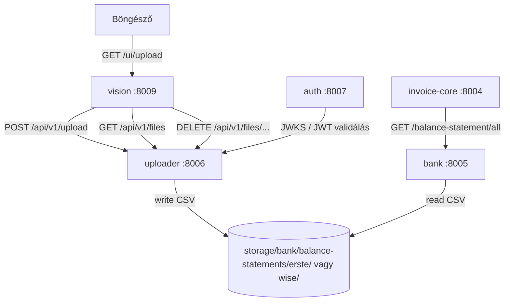

# Uploader – Bankkivonat Feltöltő Szolgáltatás — Specifikáció

> 🔗 **Kapcsolat**: feltöltött fájlokat [[bank-spec.md|Bank szerviz]] (port 8005) olvassa; UI [[vision-spec.md|Vision]] (port 8009) kiszolgálja

---

## Szerepkör és kontextus

Az Uploader egy önálló leaf mikroszerviz, amely webes felületen keresztül lehetővé teszi az Erste és Wise CSV bankkivonatok feltöltését a bank szerviz `balance-statements/` tároló mappájába. Nincs adatbázisa — csak fájlrendszert kezel.

**Probléma**: A `bank` szerviz azt feltételezi, hogy a CSV kivonatok a `balance-statements/erste/` ill. `balance-statements/wise/` alkönyvtárba kerülnek. Az Uploader webes feltöltési UI-t biztosít ehhez — így nem kell kézzel másolni a fájlokat a storage mappába.

**UI elhelyezése**: A feltöltési felület a `vision` szervizben van (`/ui/upload`). A vision közvetlenül az uploader REST API-ját hívja multipart file upload-hoz.

**Hívási lánc**:
```
Böngésző → Vision (/ui/upload) → Uploader (POST /api/v1/upload) → balance-statements/{bank}/*.csv
                                                                         ↓
                                                               Bank szerviz olvassa
```

---

## Fájl-felderítés és bankdetektálás

A banktípust a fájlnévből kell meghatározni — pontosan ugyanolyan séma szerint, ahogy a `bank` szerviz feldolgozza:

| Bank | Fájlnév-séma | Példa |
|---|---|---|
| Erste | `<számlaszám>_<YYYY-MM-DD>_<YYYY-MM-DD>.csv` | `11600006-00000001-97860425_2026-01-01_2026-06-19.csv` |
| Wise | `statement_<balanceId>_<currency>_<YYYY-MM-DD>_<YYYY-MM-DD>.csv` | `statement_25546267_HUF_2026-01-01_2026-06-17.csv` |

Detektálási logika (prioritás sorrendben; a mintaillesztés kis- és nagybetűtől független):
1. Ha a fájlnév `statement_`-tal kezdődik → **Wise**
2. Ha a fájlnév dátum-mintájú végű (`_YYYY-MM-DD_YYYY-MM-DD.csv`, regex: `.+_\d{4}-\d{2}-\d{2}_\d{4}-\d{2}-\d{2}\.csv$`) és nem `statement_`-tal kezdődik → **Erste**
3. Egyéb → `None`, a feltöltés `400` hibával elutasítva

---

## Adatmodellek

### `UploadResult`

```python
class UploadResult(BaseModel):
    filename: str           # mentett fájlnév
    bank: str               # "erste" | "wise"
    saved_path: str         # teljes elérési út a storage-ban
    size_bytes: int
    overwritten: bool       # igaz, ha azonos nevű fájl már létezett
```

### `StorageFile`

```python
class StorageFile(BaseModel):
    bank: str               # "erste" | "wise"
    filename: str
    size_bytes: int
    modified_at: datetime
    path: str
```

### `StorageStatus`

```python
class StorageStatus(BaseModel):
    storage_dir: str
    banks: dict[str, list[StorageFile]]   # {"erste": [...], "wise": [...]}
    total_files: int
```

---

## REST API (port 8006)

> **Hitelesítés**: minden végpont JWT-t igényel (lásd a [[auth-service-spec.md|JWT hitelesítés]] szakaszt lentebb) — kivéve a `GET /health`-et, ami publikus.

| Method | Endpoint | Leírás |
|---|---|---|
| `GET` | `/health` | állapotellenőrzés (publikus, JWT nélkül) |
| `GET` | `/settings` | aktív konfiguráció (storage, limitek, port, log szint) |
| `GET` | `/api/v1/files` | tárolt fájlok listája (minden bank) |
| `GET` | `/api/v1/files/{bank}` | adott bank fájljai (`erste` / `wise`); `400` ismeretlen bank esetén |
| `POST` | `/api/v1/upload` | CSV feltöltése (multipart/form-data) |
| `GET` | `/api/v1/files/{bank}/{filename}/download` | fájl letöltése (`text/csv`); `404` ha nem létezik |
| `DELETE` | `/api/v1/files/{bank}/{filename}` | fájl törlése → `204`; `404` ha nem létezik |

### `POST /api/v1/upload`

**Request**: `multipart/form-data`

| Mező | Típus | Kötelező | Leírás |
|---|---|---|---|
| `file` | `UploadFile` | igen | CSV fájl (a fájlnév `.csv` végződésű legyen) |
| `bank` | `str` | nem | `erste` \| `wise` — ha megadva, felülírja az automatikus detektálást |
| `overwrite` | `bool` | nem (default: `false`) | létező fájl felülírása |

**Validáció (sorrendben)**:
1. Hiányzó fájlnév → `400`
2. Fájlnév nem `.csv` végződésű (kis/nagybetűtől függetlenül) → `400`
3. Méret > `MAX_FILE_SIZE_MB` → `400`
4. Bankdetektálás: a `bank` mező, ha megadva, felülírja a `detect_bank()`-ot; ha az eredmény nem `erste`/`wise` → `400` (formátum-hint az üzenetben)
5. `overwrite=false` és azonos nevű fájl már létezik → `400` (`FileExistsError`)

**Response** `200 OK`: `UploadResult`

**Hibák**:
- `400` — hiányzó fájlnév, nem CSV, méretlimit túllépés, nem felismerhető formátum, `overwrite=false` és fájl már létezik
- `401` — hiányzó/érvénytelen access token (ha az auth be van kapcsolva)
- `503` — az auth szerviz (JWKS) nem érhető el
- `422` — hiányzó `file` mező (FastAPI validáció)

**Példa response**:

```json
{
  "filename": "11600006-00000001-97860425_2026-01-01_2026-06-19.csv",
  "bank": "erste",
  "saved_path": "/moneypenny/storage/bank/balance-statements/erste/11600006-00000001-97860425_2026-01-01_2026-06-19.csv",
  "size_bytes": 48320,
  "overwritten": false
}
```

### `GET /api/v1/files`

**Response** `200 OK`: `StorageStatus`

```json
{
  "storage_dir": "/moneypenny/storage/bank/balance-statements",
  "banks": {
    "erste": [
      {
        "bank": "erste",
        "filename": "11600006-00000001-97860425_2026-01-01_2026-06-19.csv",
        "size_bytes": 48320,
        "modified_at": "2026-06-24T10:30:00",
        "path": "/moneypenny/storage/bank/balance-statements/erste/11600006-00000001-97860425_2026-01-01_2026-06-19.csv"
      }
    ],
    "wise": []
  },
  "total_files": 1
}
```

---

## JWT hitelesítés

Az uploader a [[auth-service-spec.md|központi auth szerviz]] (`:8007`) JWKS kulcsaival validálja a tokeneket — a `require_auth` app-szintű dependency minden végponton fut, kivéve a `PUBLIC_PATHS = {"/health"}`-et.

- **Token forrása**: `Authorization: Bearer <access-token>` fejléc **vagy** `mp_access_token` cookie
- **Algoritmus**: RS256; ellenőrzött claim-ek: `exp`, `aud` (`moneypenny`), `iss` (`auth-service`), `typ` (`access`)
- **JWKS**: `{auth_service_url}/.well-known/jwks.json` — a `PyJWKClient` cache-eli (1 óra TTL, ismeretlen `kid` esetén újratöltés), így nincs kérésenkénti hálózati hívás az auth szerviz felé
- **Hibák**: `401` hiányzó/érvénytelen token; `503` ha az auth szerviz/JWKS nem érhető el (hálózat/TLS hiba)
- **Kikapcsolás**: `AUTH_ENABLED=false` (tesztekhez) — ilyenkor minden végpont token nélkül hívható

A Vision kliens a bejelentkezett felhasználó access tokenjét továbbítja a hívásaiban; a CLI közvetlenül a storage-t éri el, JWT nélkül.

---

## CLI (script neve: `uploader`)

```bash
uploader status                            # storage mappa + fájlok összesítése
uploader list [--bank erste|wise|all]      # elérhető fájlok listázása
uploader upload <fájl> [--bank erste|wise] [--overwrite]  # fájl feltöltése
uploader delete <bank> <fájlnév>           # fájl törlése
```

A CLI közvetlenül a storage mappát kezeli — **nem igényel JWT-t**; a `-v`/`--verbose` globális kapcsoló DEBUG naplózást kapcsol be.

---

## Vision UI (megvalósult)

A feltöltési felület a vision szervizben fut (`ui/uploader_router.py`, `prefix="/ui"`), és közvetlenül az uploader REST API-ját hívja a `clients/uploader.py`-ból (`UploaderClient`).

### Route-ok

| Method | Endpoint | Leírás |
|---|---|---|
| `GET` | `/ui/upload` | feltöltési oldal (`upload.html`) — a tárolt fájlok listájával |
| `POST` | `/ui/upload/do` | HTMX: feltöltés végrehajtása, eredmény alert partial |
| `GET` | `/ui/upload/files` | HTMX partial: tárolt fájlok táblázata (`partials/upload_files.html`) |
| `GET` | `/ui/upload/files/{bank}/{filename}/download` | átirányítás az uploader letöltési végpontjára |
| `DELETE` | `/ui/upload/files/{bank}/{filename}` | HTMX: fájl törlése |

**Tartalom**:
- Drag & drop vagy fájlböngésző (`<input type="file" accept=".csv">`)
- `Overwrite` checkbox
- Feltöltés → uploader `POST /api/v1/upload` (multipart, az auth token továbbításával)
- Eredmény: sikeres/hibás feltöltés jelzése (Bootstrap alert)
- Jelenlegi fájlok listája (`GET /api/v1/files`) — táblázatban, törölhető sorokkal (HTMX DELETE)

### Navbar

A `_sidebar.html` tartalmazza:

```
📤 Feltöltés  →  /ui/upload
```

### Vision kliens

`clients/uploader.py` — `UploaderClient`:

```python
class UploaderClient:
    def upload_file(self, file_bytes: bytes, filename: str, bank: str | None = None, overwrite: bool = False) -> dict | None: ...
    def list_files(self) -> dict | None: ...
    def delete_file(self, bank: str, filename: str) -> bool: ...
```

A kliens HTTP hibánál `{"error": ...}` dictet, hálózati hibánál `None`-t ad vissza.

---

## Projektstruktúra

```
uploader/
├── src/uploader/
│   ├── __init__.py
│   ├── auth.py            # JWT validálás az auth szerviz JWKS kulcsaival
│   ├── config.py          # pydantic-settings, közös gyökér .env
│   ├── models.py          # UploadResult, StorageFile, StorageStatus
│   ├── detector.py        # bankdetektálás fájlnévből
│   ├── storage.py         # fájl mentés / lista / törlés / letöltés
│   ├── api/
│   │   └── main.py        # FastAPI app
│   └── cli/
│       └── main.py        # Typer CLI
├── tests/                 # pytest: conftest, test_api, test_auth_jwks, test_detector, test_storage
├── Dockerfile             # uv-alapú, python3.14-bookworm-slim, EXPOSE 8006
├── pyproject.toml
└── run_api.py             # debug entry (uvicorn, reload)
```

---

## Tech stack

- Python 3.14 (`requires-python >=3.14`)
- FastAPI + Uvicorn (`python-multipart` a file upload-hoz)
- PyJWT (`pyjwt[crypto]`) + certifi — JWT validálás, TLS trust store a JWKS lekéréshez
- Typer, Rich
- Pydantic v2
- pydantic-settings (`.env` konfiguráció)
- pytest + httpx (tesztek), ruff (lint)
- Docker: `ghcr.io/astral-sh/uv:python3.14-bookworm-slim`, `EXPOSE 8006`

---

## Environment (`.env`)

A konfiguráció a **közös gyökér `.env`-ből** töltődik (`<workspace>/.env`, 340075c óta) — nincs lokális `uploader/.env`. Minden beállításnak kódbeli defaultja is van, így `.env` nélkül is működik a szerviz.

```env
# Megegyezik a bank szerviz BALANCE_STATEMENTS_DIR-jével
STORAGE_DIR=../storage/bank/balance-statements   # az uploader és bank közös könyvtár (default)
ERSTE_SUBDIR=erste
WISE_SUBDIR=wise
MAX_FILE_SIZE_MB=50
API_HOST=0.0.0.0
UPLOADER_API_PORT=8006     # API_PORT is elfogadott alias
LOG_LEVEL=INFO
# JWT / auth (lásd auth.py — az auth szerviz JWKS-ét használja)
AUTH_ENABLED=true
AUTH_SERVICE_URL=http://localhost:8007
JWT_AUDIENCE=moneypenny
JWT_ISSUER=auth-service
```

> **Fontos**: `STORAGE_DIR` ugyanaz a könyvtár, mint a `bank` szerviz `BALANCE_STATEMENTS_DIR`-je (`<workspace>/storage/bank/balance-statements`). Dev környezetben relatív elérési úttal konfigurálható; prodban abszolút út ajánlott.

A naplózás (`LOG_LEVEL`) stream + fájl (`uploader/logs/uploader.log`) formában történik.

---

## Megvalósítási állapot

Minden tétel elkészült (e2e520a → 1606239 közötti commitok):

1. ✅ `config.py` + `models.py` — pydantic-settings + modellek
2. ✅ `detector.py` — Erste/Wise fájlnév detektálás (regex)
3. ✅ `storage.py` — fájl mentés, lista, törlés a konfigurált mappában
4. ✅ `api/main.py` — FastAPI: `/health`, `/settings`, `/api/v1/files`, `/api/v1/upload`, `/api/v1/files/{bank}/{filename}/download`, DELETE
5. ✅ JWT védelem (06c9d10) — `auth.py`, app-szintű `require_auth` dependency
6. ✅ `cli/main.py` — Typer CLI: `status`, `list`, `upload`, `delete`
7. ✅ Vision UI (`ui/uploader_router.py`): `/ui/upload`, HTMX upload/delete/list, `clients/uploader.py`
8. ✅ Docker (21d44bf) + tesztek (1606239: conftest, api, auth_jwks, detector, storage)
9. ✅ Közös gyökér `.env` (340075c)

---

## Kapcsolódások



---

## Wiki Linkek

- **Prompt**: [[uploader-promp.md|Uploader Prompt]]
- **Tárolt fájlokat olvassa**: [[bank-spec.md|Bank Spec]] (port 8005)
- **UI helye**: [[vision-spec.md|Vision Spec]] (port 8009, `/ui/upload` oldal)
- **Projekt Index**: [[INDEX.md|Moneypenny Index]]
