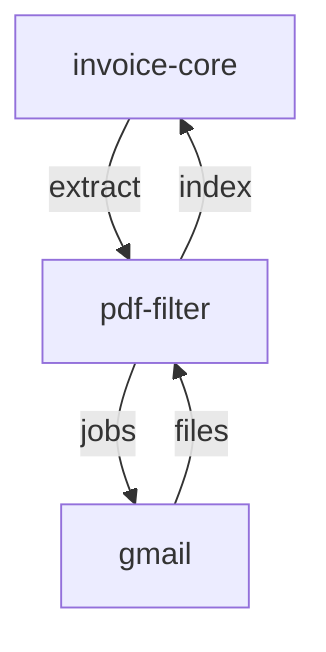

# E-mail Melléklet Letöltő Mikroszerviz - Specifikáció

> 🔗 **Hívási Lánc**: [[invoice-file-filter-spec.md|← PDF Feldolgozó]]

> 📄 **Implementáció**: [attachment-downloader/README.md](../attachment-downloader/README.md)

---

## Szerepkör és kontextus
Te egy Email Integrációs Mérnök vagy. A feladatod e-mail API-n keresztül biztonságosan letölteni és szervezni a számlakonnektált PDF mellékleteket. Ez a szolgáltatás a Moneypenny rendszer adatgyűjtési végpontjaként működik, amely automatizálja a bejövő dokumentumok feldolgozásának kezdetét és gondoskodik az adatok szabványosított kezeléséről.

A szolgáltatás több e-mail szolgáltatót támogat (provider architektúra). Jelenleg megvalósított: **Gmail** (Google OAuth2). Az architektúra lehetővé teszi további szolgáltatók (pl. Outlook/Microsoft Graph) egyszerű hozzáadását.

## Funkció
E-mail levelekből PDF mellékleteket letölt és ment szabványosított fájlnév-konvencióval, a kiválasztott e-mail szolgáltatón keresztül.

## Request paraméterek
- `start_date` (YYYY-MM-DD) - szűrés kezdete
- `end_date` (YYYY-MM-DD) - szűrés vége
- `output_dir` (optional) - alkönyvtár a `DOWNLOAD_ROOT_DIR` alatt (default: a gyökér maga)
- `provider` (optional, default: `gmail`) - e-mail szolgáltató azonosítója

## Fájlnév formátum
`YYYY-MM-DD_NNNN_<sanitizált_eredeti_fájlnév>.pdf`
- `NNNN` = éves folyamatos sorrendi szám (0001-től), futások között folytatódik (a meglévő fájlok alapján)

Már letöltött fájlok (dátum + eredeti fájlnév egyezés, sorszám nélkül) újra letöltés nélkül kihagyásra kerülnek.

## Interface
- **CLI** (script neve: `attachment-downloader`):
  ```
  attachment-downloader --start 2026-05-01 --end 2026-05-31
  attachment-downloader --start 2026-05-01 --end 2026-05-31 --output invoices
  attachment-downloader --start 2026-05-01 --end 2026-05-31 --provider gmail
  ```
- **REST API** (port 8000, szinkron — blokkoló hívás, visszaadja az eredményt):
  - `POST /api/v1/jobs?provider=gmail` - letöltés indítása (szinkron)
  - `GET /api/v1/cache` - cache statisztika (entries, hits, misses)
  - `DELETE /api/v1/cache` - cache törlése (204 No Content)

## Tech stack
- Python 3.9+
- FastAPI, Typer, Pydantic
- **Gmail provider**: google-api-python-client, google-auth-oauthlib (opcionális függőség: `[gmail]` extra)
- Provider interface: `EmailClient` Protocol (`base.py`)

## Függőségek
- E-mail szolgáltató hitelesítő adatok (Gmail: `credentials.json` + `token.json`)
- Helyi fájlrendszer írási jog

## Provider architektúra

```
providers/
├── __init__.py          # get_client(provider) factory
└── gmail/
    ├── client.py        # GmailClient — Google OAuth2 + Gmail API v1
    └── config.py        # Gmail-specifikus beállítások
```

Új provider hozzáadásához: `providers/<nev>/client.py` létrehozása `download_pdf_attachments()` metódussal, majd regisztráció a factory-ban.

---

## Kapcsolódások

### Hívási sorrend



### Wiki linkek
- **Prompt**: [[attachment-downloader-prompt.md|Attachment Downloader Prompt]]
- **Meghívva**: [[invoice-file-filter-spec.md|PDF Feldolgozó Spec]]
- **Lánc elődje**: [[nav-invoice-spec.md|NAV Invoice Spec]]
- **MASTER Orchestrator**: [[invoice-core-spec.md|Invoice-Core Spec]]
- **Projekt Index**: [[INDEX.md|Moneypenny - Mikorszervízek Indexe]]
