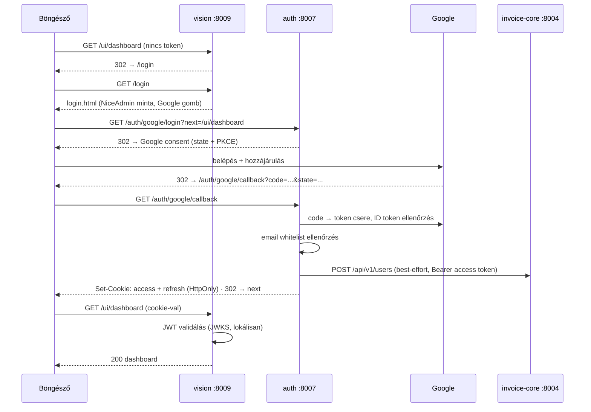
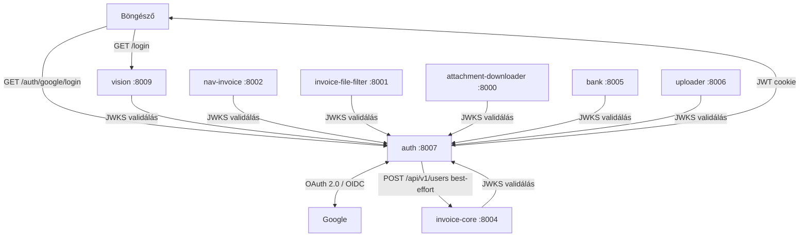

# Auth – Központi Authentication Mikroszerviz - Specifikáció

> 🔗 **Prompt**: [[auth-service-prompt.md|Auth Service Prompt]]

---

## Szerepkör és kontextus

Központi authentication mikroszerviz (Python, **FastAPI**, port **8007**). A Moneypenny rendszer **minden mikroszerviz-végpontja authentikált** — kivétel kizárólag a vision kezdőoldala (`pitch.html`) és az alább felsorolt technikai végpontok.

A mikroszervizes best practice szerint:

- **Csak ez az egy szerviz kommunikál a Google-lel** (OAuth 2.0 authorization code flow + OpenID Connect).
- Sikeres belépés után **saját kiállítású JWT**-t ad (access + refresh token, RS256).
- **A többi mikroszerviz soha nem hívja a Google-t** — kizárólag a JWT-t validálja lokálisan (aláírás a JWKS publikus kulccsal, lejárat, claims). Nincs kérésenkénti hálózati hívás az auth szerviz felé.
- **Provider architektúra**: első körben csak Google, de a szerviz és a login oldal is bővíthető további providerekkel (pl. Microsoft, GitHub).

---

## Publikus (auth nélküli) végpontok — teljes lista

Az egész rendszerben kizárólag az alábbiak érhetők el token nélkül:

| Szerviz | Végpont | Miért publikus |
|---|---|---|
| vision (8009) | `GET /` | a pitch oldal (`pitch.html`) — nyilvános bemutatkozó oldal |
| vision (8009) | `GET /pitch` | 308 redirect a `/`-ra |
| vision (8009) | `GET /login` | login oldal (NiceAdmin minta) |
| vision (8009) | `GET /static/*` | a pitch és login oldal statikus fájljai |
| auth (8007) | `GET /health` | monitoring |
| auth (8007) | `GET /auth/providers` | engedélyezett providerek listája a login oldalhoz |
| auth (8007) | `GET /auth/{provider}/login` | belépés indítása (redirect a Google-höz) |
| auth (8007) | `GET /auth/{provider}/callback` | OAuth callback a Google-től |
| auth (8007) | `POST /auth/refresh` | access token frissítése refresh tokennel |
| auth (8007) | `GET /.well-known/jwks.json` | publikus kulcsok a JWT validáláshoz |
| összes szerviz | `GET /health` | monitoring (nem ad ki üzleti adatot) |

**Minden más végpont** (invoice-core 8004, nav-invoice 8002, invoice-file-filter 8001, attachment-downloader 8000, bank 8005, uploader 8006, vision `/ui/*` és `/dashboard`) érvényes JWT nélkül:
- API hívásnál → `401 Unauthorized` (JSON hibaválasz),
- vision böngészős oldalnál → `302 redirect` a `/login` oldalra.

---

## Belépési folyamat (Google OAuth 2.0 / OpenID Connect)



Kulcspontok:
- `state` paraméter (CSRF) + **PKCE** kötelező.
- Az ID token ellenőrzése: aláírás (Google JWKS), `aud`, `iss`, `exp`, `email_verified`.
- Csak whitelistelt e-mail / domain léphet be (`ALLOWED_EMAILS` / `ALLOWED_DOMAINS`).
- Böngészőnek **HttpOnly + Secure + SameSite=Lax cookie**, szerviz-szerviz híváshoz `Authorization: Bearer <token>` fejléc. Mindkettőt minden védett szerviz elfogadja.

---

## Token kezelés

| Token | Élettartam | Tartalom |
|---|---|---|
| Access token (JWT, RS256) | 15 perc | `sub` (Google user id), `email`, `name`, `picture`, `provider`, `iat`, `exp`, `iss=auth-service`, `aud=moneypenny` |
| Refresh token (JWT, RS256) | 30 nap | `sub`, `jti` (visszavonáshoz), `iat`, `exp` |

- Aláírás: **RS256** — a privát kulcs csak az auth szerviznél van, a publikus kulcsot a `/.well-known/jwks.json` adja ki (`kid`-del, kulcsrotáció támogatott).
- A védett szervizek a JWKS-t indításkor letöltik és cache-elik (TTL, pl. 1 óra); ismeretlen `kid` esetén újratöltés.
- Refresh flow: `POST /auth/refresh` a refresh tokennel → új access token. Logout: `POST /auth/logout` → cookie törlés + refresh token `jti` visszavonás (in-memory/fájl denylist — nincs DB).

---

## Felhasználók mentése (invoice-core)

Az `auth` szerviznek nincs saját adatbázisa. Minden sikeres bejelentkezéskor
(`complete_login`, a token kiállítás után) a `UserInfo`-t **best-effort**
POST-olja az `invoice-core` (:8004) `/api/v1/users` végpontjára, a frissen
kiállított access tokennel (`Authorization: Bearer`):

- Upsert `(provider, sub)` alapján — a `user` táblát az `invoice-core` birtokolja
  (lásd [[invoice-core-spec.md|Invoice-Core Spec]] → `user` tábla).
- Ha az `invoice-core` nem érhető el, a hívás hibáját csak logolja (`logger.warning`)
  — **a bejelentkezés emiatt sosem hiúsul meg**, az auth szerviz felelőssége csak
  az authentikáció, a login-rekord tárolása másodlagos mellékhatás.
- Kliens: `auth_service/invoice_core_client.py` (`InvoiceCoreClient.save_user`), a
  bázis URL `INVOICE_CORE_URL` env változóból.

---

## Provider architektúra (bővíthetőség)

```python
class AuthProvider(Protocol):
    key: str            # "google"
    label: str          # "Belépés Google-fiókkal"
    icon: str           # "bi-google" (Bootstrap Icons osztály)

    def authorize_url(self, state: str, code_challenge: str, redirect_uri: str) -> str: ...
    def exchange_code(self, code: str, code_verifier: str, redirect_uri: str) -> UserInfo: ...
```

- Implementációk a `providers/` csomagban: első körben csak `providers/google.py`.
- Az aktív providereket az `ENABLED_PROVIDERS` env változó sorolja fel (`google`); új provider = új modul + regisztráció, a login oldal automatikusan megjeleníti (`GET /auth/providers`).

---

## Adatmodellek

```python
class UserInfo(BaseModel):
    sub: str                 # provider-beli user id
    email: str
    name: str | None
    picture: str | None      # avatar URL
    provider: str            # "google"

class TokenPair(BaseModel):
    access_token: str
    refresh_token: str
    token_type: str = "bearer"
    expires_in: int          # access token TTL másodpercben

class ProviderInfo(BaseModel):
    key: str                 # "google"
    label: str               # "Belépés Google-fiókkal"
    icon: str                # "bi-google"
    login_url: str           # "/auth/google/login"
```

---

## REST API (port 8007)

| Method | Endpoint | Auth | Leírás |
|---|---|---|---|
| `GET` | `/health` | – | állapotellenőrzés |
| `GET` | `/settings` | ✅ | aktív konfiguráció (titkok nélkül) |
| `GET` | `/.well-known/jwks.json` | – | JWT publikus kulcsok (JWKS) |
| `GET` | `/auth/providers` | – | engedélyezett providerek (`ProviderInfo[]`) a login oldalhoz |
| `GET` | `/auth/{provider}/login?next=` | – | OAuth flow indítása → 302 a providerhez |
| `GET` | `/auth/{provider}/callback` | – | OAuth callback → token kiállítás, cookie, 302 `next`-re |
| `POST` | `/auth/refresh` | refresh token | új access token |
| `POST` | `/auth/logout` | ✅ | cookie törlés + refresh token visszavonás |
| `GET` | `/auth/me` | ✅ | bejelentkezett felhasználó (`UserInfo`) |
| `POST` | `/auth/verify` | – | token introspekció (opcionális; a szervizek normál esetben lokálisan validálnak) |

---

## Védett szervizek integrációja

Minden mikroszerviz (invoice-core, nav-invoice, invoice-file-filter, attachment-downloader, bank, uploader, vision) azonos mintát követ — egy kis, projektenként bemásolt `auth.py` modul (nincs közös package a workspace-ben):

```python
# <project>/src/<pkg>/auth.py
security = HTTPBearer(auto_error=False)

async def require_auth(
    request: Request,
    credentials: HTTPAuthorizationCredentials | None = Depends(security),
) -> JWTClaims:
    token = credentials.credentials if credentials \
        else request.cookies.get("mp_access_token")
    if not token:
        raise HTTPException(401)          # vision UI: 302 → /login
    return verify_jwt(token)              # JWKS cache, RS256, exp, aud
```

- Regisztrálás app szinten: `app = FastAPI(dependencies=[Depends(require_auth)])`, a publikus végpontok (fenti táblázat) külön routerben, dependency nélkül.
- A vision a `/ui/*` oldalakon 401 helyett `RedirectResponse("/login?next=<eredeti URL>")`-t ad.
- Szerviz-szerviz hívások (pl. invoice-core → bank): a hívó a beérkező kérés Bearer tokenjét továbbadja (token passthrough).
- Env minden védett szerviznél: `AUTH_SERVICE_URL=http://localhost:8007`, `AUTH_ENABLED=true` (teszthez kikapcsolható).

---

## Login oldal (vision, `GET /login`)

- Minta: **NiceAdmin auth-login** — <https://bootstrapmade.com/content/demo/NiceAdmin/auth-login.html>
- Template: `vision/src/vision/templates/login.html` (önálló oldal, nem használja a `base.html` navbar/sidebar szerkezetét — a felhasználó még nincs bejelentkezve).
- Felépítés a minta szerint: középre igazított kártya, logó + "Vision" branding, "Biztonságos belépés" cím, üdvözlő alcím, majd a provider gombok.
- **Nincs e-mail/jelszó űrlap** — kizárólag provider-alapú belépés: első körben egyetlen **"Belépés Google-fiókkal"** gomb.
- A gombok listáját a template egy `providers` cikluson rendereli (a vision a `GET /auth/providers`-ből vagy konfigurációból tölti) → új provider felvételekor a template nem változik.
- Vizuális stack a meglévő vision oldalakkal azonos: Bootstrap 5 (Bootswatch Yeti), Bootstrap Icons, Nunito Sans / Poppins fontok, dark/light téma támogatás.
- Lábléc: © Graphtrek + link a pitch oldalra (`/`).

---

## CLI (script neve: `auth`)

```bash
auth status                        # konfiguráció + kulcsok + providerek állapota
auth keygen [--out keys/]          # RS256 kulcspár generálása (első beüzemelés)
auth verify <token>                # JWT dekódolás + validálás (debug)
auth revoke <jti>                  # refresh token visszavonása
auth providers                     # engedélyezett providerek listája
```

---

## Projektstruktúra (bank-projekt mintájára)

```
auth/
├── src/auth_service/
│   ├── __init__.py
│   ├── config.py          # pydantic-settings, .env
│   ├── models.py          # UserInfo, TokenPair, ProviderInfo, JWTClaims
│   ├── jwt_service.py     # kiállítás, validálás, JWKS, kulcsrotáció
│   ├── providers/
│   │   ├── base.py        # AuthProvider Protocol
│   │   └── google.py      # Google OAuth 2.0 / OIDC (authorization code + PKCE)
│   ├── invoice_core_client.py  # login rekord POST-olása invoice-core-ba (best-effort)
│   ├── service.py         # login flow, whitelist, refresh, revoke
│   ├── api/
│   │   └── main.py        # FastAPI app
│   └── cli/
│       └── main.py        # Typer CLI
├── keys/                  # RS256 kulcspár (gitignore!)
├── tests/
├── pyproject.toml
├── run_api.py
└── .env
```

---

## Tech stack

- Python 3.11+
- FastAPI, Typer, Rich
- Pydantic v2 + pydantic-settings (`.env`)
- **Authlib** (OAuth 2.0 / OIDC kliens) vagy httpx + google-auth
- **PyJWT + cryptography** (RS256, JWKS)
- Nincs saját adatbázis — leaf szerviz (a revoke-denylist fájl alapú). Sikeres belépéskor a felhasználó profilját és a login providert best-effort elmenti az `invoice-core` `/api/v1/users` végpontján (a friss access tokennel) — az `invoice-core` az egyetlen szerviz a workspace-ben, aminek saját PostgreSQL adatbázisa van.

---

## Environment (`.env`)

```env
# Google OAuth (Google Cloud Console → OAuth 2.0 Client ID, Web application)
GOOGLE_CLIENT_ID=xxxx.apps.googleusercontent.com
GOOGLE_CLIENT_SECRET=<titkos>
OAUTH_REDIRECT_URL=http://localhost:8007/auth/google/callback

# JWT
JWT_PRIVATE_KEY_PATH=./keys/jwt_private.pem
JWT_PUBLIC_KEY_PATH=./keys/jwt_public.pem
ACCESS_TOKEN_TTL=900              # 15 perc
REFRESH_TOKEN_TTL=2592000         # 30 nap
JWT_AUDIENCE=moneypenny
JWT_ISSUER=auth-service

# Jogosultság
ALLOWED_EMAILS=imre.tatai@graphtrek.co
ALLOWED_DOMAINS=graphtrek.co

# Providerek
ENABLED_PROVIDERS=google

# Szerver
VISION_URL=http://localhost:8009  # login utáni default redirect
API_HOST=0.0.0.0
API_PORT=8007
LOG_LEVEL=INFO
```

---

## Kapcsolódások



> A „JWKS validálás" nyíl csak a publikus kulcs időnkénti letöltését jelenti — a kérésenkénti token-ellenőrzés lokális, hálózati hívás nélkül.

---

## Wiki linkek

- **Prompt**: [[auth-service-prompt.md|Auth Service Prompt]]
- **Login oldal helye**: [[vision-spec.md|Vision Spec]] → `templates/login.html` (NiceAdmin minta)
- **Védett szervizek**: [[invoice-core-spec.md|Invoice-Core]] · [[nav-invoice-spec.md|NAV Invoice]] · [[invoice-file-filter-spec.md|Invoice-File-Filter]] · [[attachment-downloader-spec.md|Attachment Downloader]] · [[bank-spec.md|Bank]] · [[uploader-spec.md|Uploader]]
- **Login rekord tárolása**: [[invoice-core-spec.md|Invoice-Core]] `POST /api/v1/users` — lásd [[#Felhasználók mentése (invoice-core)]]
- **Minta projekt**: [[bank-spec.md|Bank Spec]] (projektstruktúra alapja)
- **Projekt Index**: [[INDEX.md|Moneypenny Index]]
