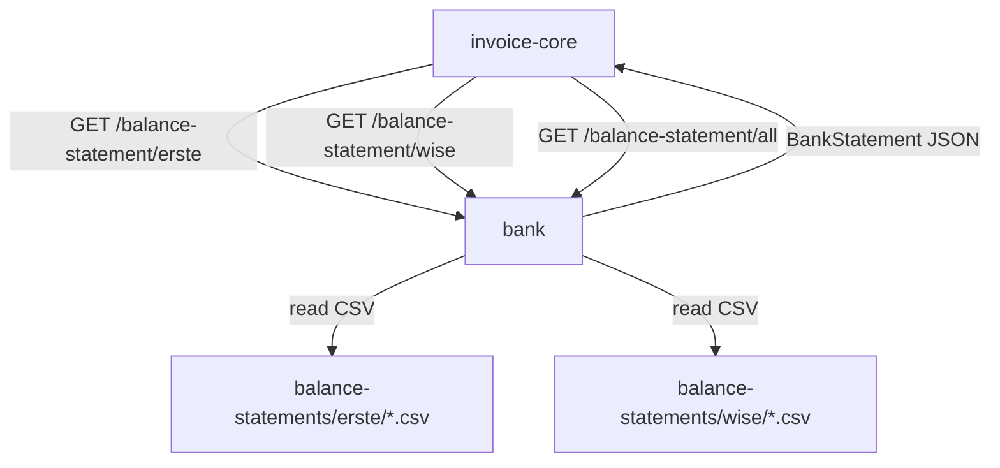

# Bank Konszolidált Kivonat Mikroszerviz - Specifikáció

> 🔗 **Hívási Lánc**: [[invoice-core-spec.md|← MASTER (invoice-core)]]

---

## Szerepkör és kontextus

Leaf mikroszerviz — adatbázist nem kezel, CSV fájlokat olvas be és strukturált JSON-t ad vissza. Az `invoice-core` orchestrator hívja. Két bank kézzel letöltött kivonat CSV-jét dolgozza fel egységes formátumba normalizálva:

| Bank | Könyvtár | Fájlnév-séma | Kódolás |
|---|---|---|---|
| Erste | `balance-statements/erste/` | `<számlaszám>_<from>_<to>.csv` | UTF-16 LE (BOM), `;` elválasztó |
| Wise | `balance-statements/wise/` | `statement_<balanceId>_<currency>_<from>_<to>.csv` | UTF-8, `,` elválasztó |

---

## Adatforrások részletezése

### Erste CSV mezők

Kódolás: UTF-16 LE BOM, pontosvesszős elválasztó, idézőjeles értékek.  
Dátumformátum: `YYYY.MM.DD`  
Összeg: ezres elválasztó `·` (középpont), negatív = terhelés.

| CSV oszlop | Leírás |
|---|---|
| `Könyvelés dátuma` | könyvelési dátum (elsődleges dátum) |
| `Tranzakció dátuma és ideje` | tényleges tranzakció datetime |
| `Összeg` | összeg (negatív = DEBIT) |
| `Devizanem` | pénznem (pl. HUF) |
| `Tranzakcióazonosító` | egyedi azonosító (pl. `F0HO10062026036547`) |
| `Közlemény` | közlemény / payment reference |
| `Partner név` | partner neve |
| `Partner IBAN száma` | partner IBAN |
| `Partner számlaszáma` | partner számlaszám |
| `Könyvelési információk` | részletes leírás |
| `Tranzakció típusa` | pl. `Átutalás`, `Bankkártya használat`, `Kamat`, `Díj` |
| `Kategória` | Erste kategória |
| `Számlasegyenleg` | egyenleg tranzakció után |

### Wise CSV mezők

Kódolás: UTF-8, vesszős elválasztó.  
Dátumformátum: `DD-MM-YYYY` (Date), `DD-MM-YYYY HH:MM:SS.mmm` (Date Time)

| CSV oszlop | Leírás |
|---|---|
| `TransferWise ID` | egyedi azonosító (pl. `CARD-3911917494`, `TRANSFER-2186101708`) |
| `Date` | dátum |
| `Date Time` | datetime |
| `Amount` | összeg (negatív = DEBIT) |
| `Currency` | pénznem |
| `Description` | leírás |
| `Payment Reference` | közlemény |
| `Running Balance` | egyenleg tranzakció után |
| `Payer Name` | küldő neve (CREDIT esetén) |
| `Payee Name` | fogadó neve (DEBIT esetén) |
| `Payee Account Number` | fogadó számlaszám |
| `Merchant` | kereskedő neve |
| `Transaction Type` | `CREDIT` / `DEBIT` |
| `Transaction Details Type` | `CARD` / `DEPOSIT` / `TRANSFER` |
| `Total fees` | díj összege |
| `Exchange From` / `Exchange To` / `Exchange Rate` | devizacsere adatok |

---

## Egységes adatmodell

### `BankTransaction`

```python
class BankTransaction(BaseModel):
    bank: str                        # "erste" | "wise"
    transaction_id: str              # Erste: Tranzakcióazonosító; Wise: TransferWise ID
    date: date                       # ISO 8601 (YYYY-MM-DD)
    datetime: datetime | None        # ISO 8601 datetime, ha elérhető
    amount: Decimal                  # abszolút érték
    currency: str                    # ISO 4217 (pl. "HUF")
    direction: Literal["CREDIT", "DEBIT"]  # pozitív összeg→CREDIT, negatív→DEBIT
    description: str | None          # Erste: Könyvelési információk; Wise: Description
    payment_reference: str | None    # Erste: Közlemény; Wise: Payment Reference
    counterparty_name: str | None    # Erste: Partner név; Wise: Payer/Payee Name
    counterparty_account: str | None # Erste: Partner számlaszáma; Wise: Payee Account Number
    counterparty_iban: str | None    # Erste: Partner IBAN száma
    transaction_type: str | None     # Erste: Tranzakció típusa; Wise: Transaction Details Type
    category: str | None             # Erste: Kategória; Wise: nincs (None)
    balance: Decimal | None          # egyenleg a tranzakció után
    fees: Decimal | None             # Wise: Total fees; Erste: None
```

### `StatementFile`

```python
class StatementFile(BaseModel):
    bank: str           # "erste" | "wise"
    filename: str
    account_id: str     # Erste: számlaszám; Wise: balanceId
    currency: str | None
    from_date: date
    to_date: date
    path: str
```

### `BankStatement`

```python
class BankStatement(BaseModel):
    bank: str
    filename: str
    account_id: str
    currency: str | None
    from_date: date
    to_date: date
    fetched: int
    transactions: list[BankTransaction]
```

### `ConsolidatedStatement`

```python
class ConsolidatedStatement(BaseModel):
    from_date: date | None
    to_date: date | None
    banks: list[str]
    total: int
    transactions: list[BankTransaction]  # dátum szerint csökkenő sorrendben
```

---

## Fájlnév-séma és felderítés

### Erste
`<számlaszám>_<YYYY-MM-DD>_<YYYY-MM-DD>.csv`  
pl. `11600006-00000001-97860425_2026-01-01_2026-06-19.csv`

Parsing:
- `account_id` = az első `_` előtt lévő rész
- `from_date`, `to_date` = az utolsó két `_`-dal elválasztott dátum

### Wise
`statement_<balanceId>_<currency>_<YYYY-MM-DD>_<YYYY-MM-DD>.csv`  
pl. `statement_25546267_HUF_2026-01-01_2026-06-17.csv`

Parsing: split `_` → `["statement", balanceId, currency, from, to]`

---

## REST API (port 8005)

| Method | Endpoint | Leírás |
|---|---|---|
| `GET` | `/health` | állapotellenőrzés |
| `GET` | `/settings` | aktív konfiguráció |
| `GET` | `/balance-statements` | elérhető CSV fájlok listája (minden bank) |
| `GET` | `/balance-statements/{bank}` | adott bank elérhető fájljai (`erste` / `wise`) |
| `GET` | `/balance-statement/{bank}` | **fő endpoint** — adott bank tranzakciói ← invoice-core ezt hívja |
| `GET` | `/balance-statement/all` | konszolidált lista (Erste + Wise együtt) |
| `GET` | `/balance-statement/{bank}/{filename}` | konkrét fájl beolvasása |

### `GET /balance-statement/{bank}` query paraméterek

| Paraméter | Típus | Leírás |
|---|---|---|
| `from` | `YYYY-MM-DD` (optional) | ettől a dátumtól tartalmazzon adatot |
| `to` | `YYYY-MM-DD` (optional) | eddig a dátumig tartalmazzon adatot |
| `currency` | string (optional) | pénznem szűrő (pl. `HUF`) |

Szűrő nélkül: a legfrissebb CSV fájl adatait adja vissza.

### Response: `BankStatement` / `ConsolidatedStatement` (JSON)

```json
{
  "bank": "erste",
  "filename": "11600006-00000001-97860425_2026-01-01_2026-06-19.csv",
  "account_id": "11600006-00000001-97860425",
  "currency": "HUF",
  "from_date": "2026-01-01",
  "to_date": "2026-06-19",
  "fetched": 42,
  "transactions": [
    {
      "bank": "erste",
      "transaction_id": "F0HO10062026036547",
      "date": "2026-06-12",
      "datetime": "2026-06-10T12:46:53",
      "amount": "13470.00",
      "currency": "HUF",
      "direction": "DEBIT",
      "description": "416583xxxxxx4076 87204990 Google Pay Alza.hu Huszar 260610...",
      "payment_reference": null,
      "counterparty_name": "Alza.hu Huszar u. 3",
      "counterparty_account": null,
      "counterparty_iban": null,
      "transaction_type": "Bankkártya használat",
      "category": "Online vásárlás",
      "balance": "3343587.00",
      "fees": null
    }
  ]
}
```

---

## CLI (script neve: `bank`)

```bash
bank status                                      # CSV mappák + fájlok összesítése
bank list [--bank erste|wise|all]                # elérhető fájlok listázása
bank import <filename> [--json]                  # egy CSV beolvasása
bank statements [--bank erste|wise|all] [--from YYYY-MM-DD] [--to YYYY-MM-DD] [--currency HUF] [--json]
```

---

## Projektstruktúra (wise-projekt mintájára)

```
bank/
├── src/bank/
│   ├── __init__.py
│   ├── config.py          # pydantic-settings, .env
│   ├── models.py          # BankTransaction, BankStatement, ConsolidatedStatement
│   ├── parsers/
│   │   ├── erste.py       # UTF-16, ';' → BankTransaction[]
│   │   └── wise.py        # UTF-8, ',' → BankTransaction[]
│   ├── service.py         # file discovery, szűrés, konszolidáció
│   ├── api/
│   │   └── main.py        # FastAPI app
│   └── cli/
│       └── main.py        # Typer CLI
├── balance-statements/
│   ├── erste/
│   └── wise/
├── pyproject.toml
├── run_api.py
└── .env
```

---

## Tech stack

- Python 3.11+
- FastAPI, Typer, Rich
- Pydantic v2
- pydantic-settings (`.env` konfiguráció)
- `csv` + `codecs` (UTF-16 BOM kezelés)

---

## Environment (`.env`)

```env
BALANCE_STATEMENTS_DIR=./balance-statements   # alap könyvtár
ERSTE_SUBDIR=erste                            # relatív az alap könyvtárhoz
WISE_SUBDIR=wise
API_HOST=0.0.0.0
API_PORT=8005
LOG_LEVEL=INFO
```

---

## Erste CSV különlegességek

- **Kódolás**: UTF-16 Little Endian BOM (`\xff\xfe`) — `open(file, encoding="utf-16")` szükséges
- **Elválasztó**: `;` (nem `,`)
- **Összeg formátum**: `"2·133·600"` — a `·` (U+00B7 középpont) ezres elválasztó, nem tizedes pont; a `-` negatív előjel külön karakter (`"-602·000"`)
- **Egyenleg**: `"4·276·057 HUF"` — pénznem kód a végén, eltávolítandó
- **Dátumformátum**: `2026.06.12` → `datetime.strptime(v, "%Y.%m.%d")`
- **Datetime formátum**: `2026.06.10 12:46:53` → `datetime.strptime(v, "%Y.%m.%d %H:%M:%S")`
- **Irány**: `Összeg` előjele alapján — pozitív → CREDIT, negatív → DEBIT

---

## Kapcsolódások



---

## Wiki linkek

- **Prompt**: [[bank-prompt.md|Bank Prompt]]
- **Meghívva**: [[invoice-core-spec.md|Invoice-Core (MASTER)]]
- **Meghívom**: (senki — CSV fájlokat olvas, DB-t nem kezel)
- **Minta projekt**: [[wise-spec.md|Wise Spec]] (projektstruktúra alapja)
- **Projekt Index**: [[INDEX.md|Moneypenny Index]]
