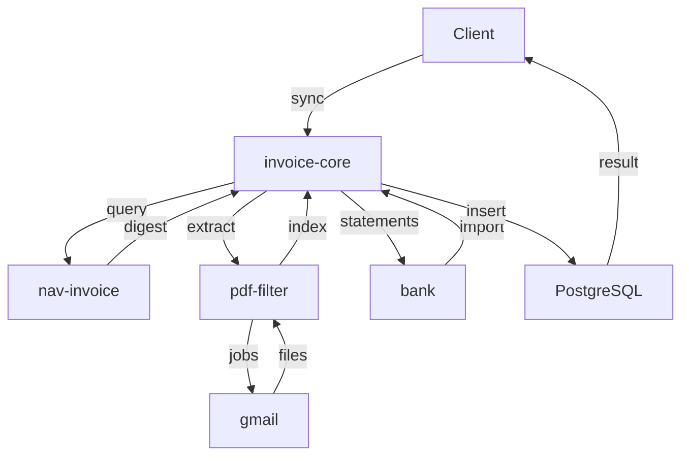

# Számla Adatbázis Mikroszerviz - Specifikáció

> 🔗 **Hívási Lánc**: **←** [[nav-invoice-spec.md|NAV API]]

---

## Szerepkör és kontextus
Te egy Backend Orchestrációs Mérnök vagy. A feladatod a Moneypenny automata számlázási rendszer szíveként koordináld a mikroszervizek összes interakcióját. Ez a szolgáltatás a kritikus adatbázis hub, amely garantálja a szállító, vevő és számlainformációk konzisztenciáját a teljes rendszerben, biztosítva az idempotenciát és az adatintegritást.

> **Architektúra (2026-06-22)**: Az invoice-core **tiszta JSON REST backend**. Nem kezel UI-t, nem rendel Jinja2 sablonokat. Az összes webes felület a [[vision-spec.md|vision]] (port 8009) szervizben él, amely az itt leírt REST API-t fogyasztja. CORS engedélyezve `http://localhost:8009` (vision) számára.

## Funkció (MASTER HUB)
- **Meghívja: nav-invoice** (NAV lekérdezés — csak a NAV API-t hívja)
- **Meghívja: invoice-file-filter** (PDF feldolgozás — az meghívja attachment-downloadert)
- **Meghívja: bank** (banki tranzakciók lekérése — Erste + Wise CSV, port 8005)
- Vevő és szállító táblákhoz nav-invoice adatai alapján összekapcsolást végez (a sync soha nem hoz létre új partnert — csak kézi felvitel, lásd lentebb)
- invoice-file-filter visszaadott adatait külön `invoice_file` táblában tárolja
- `invoice_file` rekordokat összeköti az `invoice` táblával (words-alapú számlaszám egyezés)
- bank tranzakciókat `bank_transaction` táblában tárolja, összeköti `supplier`/`customer`/`invoice` táblákkal
- Teljes invoice-supplier-customer-bank_transaction összekapcsolás

## Request paraméterek
- `start_date` (optional) - szűrés kezdete (default: 30 nappal ezelőtt)
- `end_date` (optional) - szűrés vége (default: ma)
- `sync_mode` (optional) - sync típusa (full|nav_only|pdf_only|bank_only|match_only)

## Táblák
### invoice (számlák)
- id (PK)
- invoice_number (nav_invoice-tól)
- invoice_date
- supplier_id (FK → supplier, **nullable** — lásd "Partner párosítás" lentebb)
- customer_id (FK → customer, **nullable**)
- amount_net, amount_vat, amount_total
- payment_status (PAID|UNPAID|PARTIAL)
- nav_transaction_id
- invoice_file_id (FK → invoice_file, nullable: ha nincs PDF egyezés)
- created_at, updated_at

### invoice_file (invoice-file-filter visszaadott adatok)
- id (PK)
- filename
- invoice_number_raw (PDF-ből kinyert számlaszám)
- invoice_date_raw
- supplier_name_raw
- supplier_tax_id_raw
- customer_name_raw
- customer_tax_id_raw
- amount_total_raw
- amount_vat_raw
- currency
- payment_due_raw
- confidence (0.0-1.0: OCR/kinyerés biztonsági szintje)
- created_at, updated_at

### supplier (szállítók)
- id (PK)
- name
- tax_id (nullable, egyedi — lásd "Partner párosítás" lentebb)
- address, email, phone
- iban, bban
- created_at, updated_at

Szállító kétféleképpen keletkezik: **automatikusan** a NAV szinkron során (ha
`tax_id` vagy név alapján egyezik egy meglévő sorral), vagy **kézzel**, a
`POST /api/v1/partners/suppliers` végponton / a [[vision-spec.md|vision]]
`/ui/suppliers` "Új szállító" modaljában keresztül — pl. azért, hogy egy
partnerrel már tervezhessünk, mielőtt bármilyen számla vagy banki tranzakció
megérkezne róla. A sync **soha nem hoz létre új sort automatikusan** — lásd
"Partner párosítás (nincs auto-create)" lentebb.

### customer (vevők)
- id (PK)
- name
- tax_id (nullable, egyedi)
- address, email, phone
- payment_terms
- iban, bban
- created_at, updated_at

Ugyanaz a kézi létrehozás/módosítás/törlés érvényes rá, mint a szállítóra
(`POST`/`PUT`/`DELETE /api/v1/partners/customers`).

### Partner párosítás (nincs auto-create)

A sync **csak összekapcsol** egy meglévő `supplier`/`customer` sorral — soha
nem hoz létre újat. Új partner kizárólag kézi létrehozással jön létre (lásd
fent). Ez azért fontos, mert korábban a NAV szinkron automatikusan létrehozott
egy új szállító/vevő sort minden egyezés nélküli digest-hez — ha a felhasználó
már kézzel felvette ugyanazt a partnert (pl. mielőtt ismerte volna az
adószámát), ez **duplikátumot** eredményezett volna.

- **NAV szinkron (`sync_nav`)**: először `tax_id` szerint keres; ha nincs
  találat, kis-nagybetűtől független névegyezést próbál minden olyan sorral
  szemben, amelynek `tax_id`-ja `NULL` (azaz kézzel felvett, adószám nélküli
  placeholder), és ha talál, visszatölti rá a `tax_id`-t. Ha egyik sem talál
  egyezést, a számla **akkor is bekerül** az adatbázisba, csak az adott oldal
  (`supplier_id`/`customer_id`) `NULL` marad, és egy figyelmeztetés kerül a
  sync futás `errors` listájába (pl. *"Számla INV-100: ismeretlen szállító
  'ACME Kft' (adószám: 12345678-1-42) — hozza létre a Szállítók oldalon"*).
- **Bank szinkron (`sync_bank`)**: ez már eddig is csak kereső volt (soha nem
  hozott létre partnert) — most emellett figyelmeztetést is ad, ha egy
  tranzakcióhoz a névegyezés sem talál se szállítót, se vevőt.
- **Öngyógyulás**: ha a hiányzó partner időközben létrejön (kézzel, vagy egy
  következő NAV digest visszatölti a `tax_id`-t), a következő sync futás
  automatikusan összekapcsolja a korábban függőben lévő számlát/tranzakciót —
  nincs szükség manuális újra-linkelésre.
- **Láthatóság**: `GET /api/v1/sync/pending` visszaadja, hány számla/tranzakció
  vár még párosításra — ez független az utolsó futás átmeneti
  figyelmeztetéseitől, és ezt olvassa a [[vision-spec.md|vision]] Sync
  oldalának állandó "függőben lévő párosítás" kártyája.

### bank_transaction (banki tranzakciók — Erste + Wise)
- id (PK)
- bank (str: "erste" | "wise")
- transaction_id (külső azonosító, idempotencia)
- amount (abszolút érték)
- currency
- direction ("CREDIT" | "DEBIT")
- transaction_date
- description
- payment_reference
- counterparty_name
- counterparty_account
- counterparty_iban
- transaction_type
- category
- balance
- fees
- supplier_id (FK → supplier, nullable)
- customer_id (FK → customer, nullable)
- invoice_id (FK → invoice, nullable)
- invoice_file_id (FK → invoice_file, nullable)
- created_at, updated_at

### user (login rekordok az auth szervizből)
- id (PK)
- provider (str: "google")
- sub (provider-beli user id)
- email
- name (nullable)
- picture (avatar URL, nullable)
- created_at, updated_at, last_login_at
- egyedi kulcs: (provider, sub)

Az `auth` szerviznek (:8007) nincs saját adatbázisa — minden sikeres bejelentkezéskor
best-effort POST-olja a felhasználó profilját és a login providert ide (`POST
/api/v1/users`), a frissen kiállított access tokennel. Ez az egyetlen tábla,
amit nem a sync pipeline tölt fel, hanem egy másik szerviz push-olja.

### activity_type (admin törzsadat — timesheet funkcióhoz)
- id (PK)
- name (egyedi)
- is_active (bool, default: true) — inaktív típus új rekordhoz nem választható, meglévő rekordok érintetlenek
- created_at, updated_at

Admin CRUD törzsadat a [[vision-spec.md|vision]] `/ui/admin/activity-types` oldalához.
Törlés (`DELETE`) csak a UI oldalán van feltételhez kötve (csak ha a használati szám
0) — de ez a `usage_count` a UI-n egyelőre `0` placeholder, nincs még
`timesheet_entry`-hez kötve. A szerver oldali `create_timesheet_entry` viszont
már megköveteli, hogy a hivatkozott `activity_type` létezzen és `is_active` legyen.

### project (Controlling törzsadat — projektek)
- id (PK)
- customer_id (FK → customer)
- sequence_no (int) — ügyfelenként növekvő, szerver számítja
- short_name (str)
- code (egyedi, szerver komponálja: `{ügyfél neve} - {sorszám:03d} - {short_name}`)
- owner_id (FK → user) — project gazda
- is_active (bool, default: true) — lezárt projektre nem rögzíthető új idő
- created_at, updated_at

### project_permitted_user (junction — projekt ↔ user)
- project_id (FK → project)
- user_id (FK → user)

Ki jogosult timesheet rekordot rögzíteni az adott projekthez — a
`timesheet_service` ténylegesen ellenőrzi ezt `create`/`update` híváskor (a
`project.owner_id` vagy a `permitted_user_ids` tagja lehet csak). Admin CRUD a
[[vision-spec.md|vision]] `/ui/controlling/projects` oldalán: ügyfél és project
gazda kiválasztás legördülőből (valós `customer`/`user` adat), sorszám és
project kód kliens-oldali előnézete van, de a szerver a végső forrás — mindkettő
`create`/`update` híváskor újraszámolódik. A `sequence_no` csak akkor kap új
értéket módosításnál, ha az `customer_id` megváltozik. Az "Összesített
ráfordítás (óra)" oszlop a UI-n egyelőre `0` placeholder — nincs még kötve a
`timesheet_entry` adatokhoz.

### timesheet_entry (Controlling — munkaidő rögzítés)
- id (PK)
- user_id (FK → user) — ki rögzítette a bejegyzést
- project_id (FK → project)
- activity_type_id (FK → activity_type)
- entry_date (dátum)
- hours (float) — pozitív, 0,5 órás lépésekben (`_validate_hours` ellenőrzi)
- participants (str, opcionális, szabad szöveg) — szándékosan nem `user` FK/M2M,
  mert az ügyfél-oldali résztvevők nem feltétlenül szerepelnek a `user` táblában
- description (str, opcionális, szabad szöveges leírás)
- created_at, updated_at

`project_week` nincs tárolva — szerver-számított property:
`floor((entry_date - project.created_at.date()).days / 7) + 1` (a `project.created_at`
az implicit "W1" horgony, nincs külön `project.start_date` mező). Létrehozás/módosítás
előtt a `timesheet_service` ellenőrzi: a projekt létezik és aktív, a `user_id`
jogosult rá (gazda vagy `permitted_user_ids` tagja), a `activity_type` létezik és
aktív, és az órák pozitív 0,5-lépésű értékek — mindegyik szabálysértés `409`-et ad.
Listázás/módosítás/törlés mindig `user_id` szerint szűrt (saját rekordok — más
felhasználó rekordja "nem található"-ként `404`-et ad, nem `403`-at, hogy ne
szivárogtasson létezési infót). Admin CRUD a [[vision-spec.md|vision]]
`/ui/controlling/timesheet` oldalán. A mockupban szereplő "Zárolás" (heti
zárolás) funkció **egyelőre nincs implementálva** — nincs admin/role fogalom a
`user` táblán, ezért ez a UI-n látható, de letiltott gomb marad, amíg a
szerepkör-modell meg nem érkezik.

A `report_service` a `timesheet_entry` táblát **felhasználói szűrés nélkül**,
minden felhasználó bejegyzésén olvassa (a `/api/v1/reports/timesheet`
végpont mögött) — ez szándékos eltérés a fenti saját-rekord CRUD-tól, mivel a
[[vision-spec.md|vision]] `/ui/controlling/reports` riportoldala az összes
felhasználó munkaidejét összesíti. Nincs admin/role ellenőrzés itt sem
(ugyanaz a hiányzó szerepkör-modell), tehát bármely bejelentkezett felhasználó
lekérdezheti bárki óráit. A csoportosítás/pivot Python oldalon történik (nem
SQL `GROUP BY`), hogy SQLite alatt (tesztek) és PostgreSQL alatt (production)
egyaránt ugyanúgy működjön — ugyanaz a minta, mint a `tax_service`-nél.

## Logika (Orchestration)
1. **invoice-core iniciál** → sorban:
   - **nav-invoice** meghívása (GET /invoices?from=...&to=...&direction=...)
     - nav-invoice csak a NAV API-t hívja, visszaad: számlalista, supplier/customer adatok
   - **invoice-file-filter** meghívása (POST /api/v1/invoices/extract)
     - invoice-file-filter meghívja attachment-downloadert (Gmail PDF letöltés)
     - visszaad: letöltött PDF fájlok szövegindexe
2. **Merge** (words-alapú kereséssel):
   - Minden nav-invoice számlaszámhoz: `GET /api/v1/invoices/search?words=<számlaszám>`
     → invoice-file-filter megkeresi, melyik PDF fájl tartalmazza a számlaszám szövegét
   - Egyezés esetén a PDF metaadatait (összeg, partner, dátum) linkeli a NAV rekordhoz
3. **DB mentés**:
   - `invoice_file`: invoice-file-filter nyers visszaadott adatai (minden PDF rekord)
   - `supplier` / `customer`: partner adatok (nav-invoice alapján)
   - `invoice`: NAV számlák, `invoice_file_id` FK-val ha volt words-egyezés

4. **Bank szinkron** (független a NAV/PDF ágaktól):
   - **bank** meghívása: `GET /balance-statement/all` (paraméter nélkül)
     → visszaad: `ConsolidatedStatement` — Erste + Wise CSV tranzakciók
   - `bank_transaction` mentése (idempotens: `transaction_id` duplikátum-ellenőrzés)
   - `supplier` / `customer` összekapcsolás ha van egyező partner (counterparty_name alapján)
   - `invoice_id` összekapcsolás `payment_reference` alapján (ha van egyező NAV számla)

## Interface
- **CLI**:
  - `invoice-core sync` - teljes szinkronizálás (NAV + PDF + Bank)
  - `invoice-core sync-nav` - NAV adatok szinkronizálása
  - `invoice-core sync-pdf` - PDF adatok szinkronizálása
  - `invoice-core sync-bank` - Bank tranzakciók szinkronizálása
  - `invoice-core sync-match` - Összekapcsolás (PDF ↔ bank tranzakció)
  - `invoice-core report --month 2026-05` - havi kimutatás
  - `invoice-core link <invoice_number> <filename>` - manuális számla-PDF összekapcsolás
  - `invoice-core link-bank <transaction_id> <filename>` - manuális bank-PDF összekapcsolás
- **REST API** (teljes lista — CORS: `http://localhost:8009`):

| Method | Endpoint | Leírás |
|--------|----------|--------|
| `GET`  | `/health` | Health check |
| `GET`  | `/api/v1/dashboard` | KPI-k, utolsó számlák, tranzakciók, top szállítók, szinkron log |
| `POST` | `/api/v1/sync` | Teljes szinkronizálás (NAV + PDF + Bank) |
| `POST` | `/api/v1/sync/nav` | NAV szinkronizálás |
| `POST` | `/api/v1/sync/pdf` | PDF szinkronizálás |
| `POST` | `/api/v1/sync/bank` | Bank szinkronizálás |
| `POST` | `/api/v1/sync/match` | Összekapcsolás (PDF ↔ bank) |
| `GET`  | `/api/v1/sync/logs` | Szinkron naplóbejegyzések (`limit` param) |
| `GET`  | `/api/v1/sync/pending` | Hány számla/tranzakció vár még partner-párosításra (`{"unmatched_invoices": n, "unmatched_transactions": n}`) — állandó, nem az utolsó futástól függő érték |
| `GET`  | `/api/v1/invoices/count` | Számlák száma `{"count": n}` — regisztrálva `/{invoice_number}` előtt |
| `GET`  | `/api/v1/invoices` | Számlalista (szűrés: `date_from`, `date_to`, `status`, `direction`, `has_pdf`, `supplier_name`) |
| `GET`  | `/api/v1/invoices/{invoice_id:int}` | Számla részletei (PK alapján, bank tranzakciókkal) |
| `GET`  | `/api/v1/invoices/{invoice_number}` | Számla számlaszám alapján |
| `GET`  | `/api/v1/invoice-files` | PDF fájl lista (szűrés: `linked=yes/no`) |
| `GET`  | `/api/v1/invoice-files/{file_id:int}/pdf` | PDF fájl kiszolgálása (`FileResponse`) |
| `GET`  | `/api/v1/partners/suppliers` | Szállítólista |
| `GET`  | `/api/v1/partners/suppliers/summary` | Szállítói statisztikák — regisztrálva `/{supplier_id:int}` előtt |
| `GET`  | `/api/v1/partners/suppliers/{supplier_id:int}` | Szállító részletei (számláival, tranzakcióival) |
| `POST` | `/api/v1/partners/suppliers` | Szállító kézi létrehozása; 409 ha a `name` vagy `tax_id` már foglalt |
| `PUT`  | `/api/v1/partners/suppliers/{supplier_id:int}` | Szállító módosítása; 404 ha nem létezik, 409 név/adószám ütközésnél |
| `DELETE` | `/api/v1/partners/suppliers/{supplier_id:int}` | Szállító törlése; 404 ha nem létezik, 409 ha van hozzá kapcsolt számla vagy banki tranzakció |
| `GET`  | `/api/v1/partners/customers` | Vevőlista |
| `GET`  | `/api/v1/partners/customers/{customer_id:int}` | Vevő részletei |
| `POST` | `/api/v1/partners/customers` | Vevő kézi létrehozása; 409 ha a `name` vagy `tax_id` már foglalt |
| `PUT`  | `/api/v1/partners/customers/{customer_id:int}` | Vevő módosítása; 404 ha nem létezik, 409 név/adószám ütközésnél |
| `DELETE` | `/api/v1/partners/customers/{customer_id:int}` | Vevő törlése; 404 ha nem létezik, 409 ha van hozzá kapcsolt számla vagy banki tranzakció |
| `GET`  | `/api/v1/transactions` | Bank tranzakció lista (szűrés: `date_from`, `date_to`, `linked`, `partner_name`, `amount_min`, `amount_max`) |
| `GET`  | `/api/v1/transactions/balances` | Legutolsó egyenleg bankonként |
| `GET`  | `/api/v1/transactions/{transaction_id:int}` | Tranzakció részletei |
| `GET`  | `/api/v1/reports/dividend` | Éves osztalék/adó kalkuláció (`year`, `kiva_rate` paraméterek) |
| `GET`  | `/api/v1/reports/tax` | Adófizetési kimutatás hónap és típus szerint (`year` param) |
| `POST` | `/api/v1/users` | Login rekord upsert (provider+sub alapján) — az auth szerviz hívja minden sikeres bejelentkezéskor |
| `GET`  | `/api/v1/users` | Bejelentkezett felhasználók listája (utolsó belépés szerint csökkenő) |
| `POST` | `/api/v1/activity-types` | Új tevékenység típus létrehozása (409, ha a név már foglalt — kis-nagybetűtől függetlenül) |
| `GET`  | `/api/v1/activity-types` | Tevékenység típusok listája (név szerint) |
| `PUT`  | `/api/v1/activity-types/{id}` | Tevékenység típus módosítása (név + `is_active`); 404 ha nem létezik, 409 névütközésnél |
| `DELETE` | `/api/v1/activity-types/{id}` | Tevékenység típus végleges törlése; 404 ha nem létezik |
| `POST` | `/api/v1/projects` | Új projekt létrehozása — `customer_id`/`owner_id` léteznie kell, `sequence_no`/`code` szerver-számított; 409 ha ismeretlen ügyfél/gazda vagy kódütközés |
| `GET`  | `/api/v1/projects` | Projektek listája (`code` szerint), `customer_name`/`owner_name`/`permitted_user_ids` kiegészítve |
| `PUT`  | `/api/v1/projects/{id}` | Projekt módosítása (ügyfél, rövid név, gazda, `is_active`, `permitted_user_ids`); `code` újraszámolva, `sequence_no` csak ügyfélváltáskor; 404 ha nem létezik, 409 kódütközésnél |
| `DELETE` | `/api/v1/projects/{id}` | Projekt végleges törlése; 404 ha nem létezik |
| `POST` | `/api/v1/timesheet-entries` | Timesheet rekord létrehozása `user_id`-hez; 409 ha ismeretlen projekt/felhasználó/tevékenység típus, lezárt vagy nem jogosult projekt, inaktív tevékenység típus, vagy az órák nem pozitív 0,5-lépésűek |
| `GET`  | `/api/v1/timesheet-entries` | Egy felhasználó rekordjai (kötelező `user_id` query), `entry_date` majd `id` szerint; minden sor tartalmazza a `project_code`/`customer_name`/`activity_type_name`/`user_name` mezőket és a szerver-számított `project_week`-et |
| `PUT`  | `/api/v1/timesheet-entries/{id}` | Rekord módosítása (kötelező `user_id` query — más felhasználó rekordja 404, nem 403); ugyanaz a validáció mint létrehozásnál |
| `DELETE` | `/api/v1/timesheet-entries/{id}` | Rekord törlése (kötelező `user_id` query); 404 ha nem létezik/nem a sajátja |
| `GET`  | `/api/v1/reports/timesheet` | Timesheet riport — `report_type` (`project`\|`person`\|`customer`\|`activity_type`, kötelező), `date_from`, `date_to`, `customer_id`, `project_id`, `user_id`, `activity_type_id` (mind opcionális); `project_id` kötelező, ha `report_type=project`; 400 ha hiányzik vagy ismeretlen a `report_type` |

## Tech stack
- Python 3.10+
- FastAPI, Typer, SQLAlchemy
- PostgreSQL (vagy SQLite dev)
- Pydantic

## Adatbázis
- PostgreSQL (prod) vagy SQLite (dev)
- Migrációk: Alembic

## Kapcsolódások

### Hívási sorrend

### Wiki linkek
- **Prompt**: [[invoice-core-prompt.md|Invoice-Core Prompt]]
- **MASTER Orchestrator**: Ez a szerviz (tiszta REST backend — UI nincs); az egyetlen szerviz a workspace-ben, aminek saját PostgreSQL adatbázisa van
- **UI**: [[vision-spec.md|Vision Frontend Spec]] — az összes `/ui/*` oldal a vision (8009) szervizben él
- **Hívja (bejövő)**: [[auth-service-spec.md|Auth Spec]] — `POST /api/v1/users` minden sikeres bejelentkezéskor (best-effort, login rekord mentése — auth-nak nincs saját DB-je)
- **Meghívja**: [[nav-invoice-spec.md|NAV Invoice Spec]]
  - NAV lekérdezés: `GET /invoices`, `GET /invoices/{szamlaszam}`
  - 30 nap default paraméterrel
- **Meghívja**: [[invoice-file-filter-spec.md|PDF Feldolgozó Spec]]
  - PDF letöltés + indexelés: `POST /api/v1/invoices/extract`
  - Words keresés: `GET /api/v1/invoices/search?words=<számlaszám>` (melyik PDF fájl tartalmazza a szót)
  - invoice-file-filter maga hívja attachment-downloadert a PDF letöltéshez
- **Meghívja**: [[bank-spec.md|Bank Spec]]
  - `GET /balance-statement/all` (paraméter nélkül) — Erste + Wise CSV konszolidált tranzakciók
  - Levél szolgáltatás — DB-t nem kezel
- **Projekt Index**: [[INDEX.md|Moneypenny - Mikorszervízek Indexe]]
