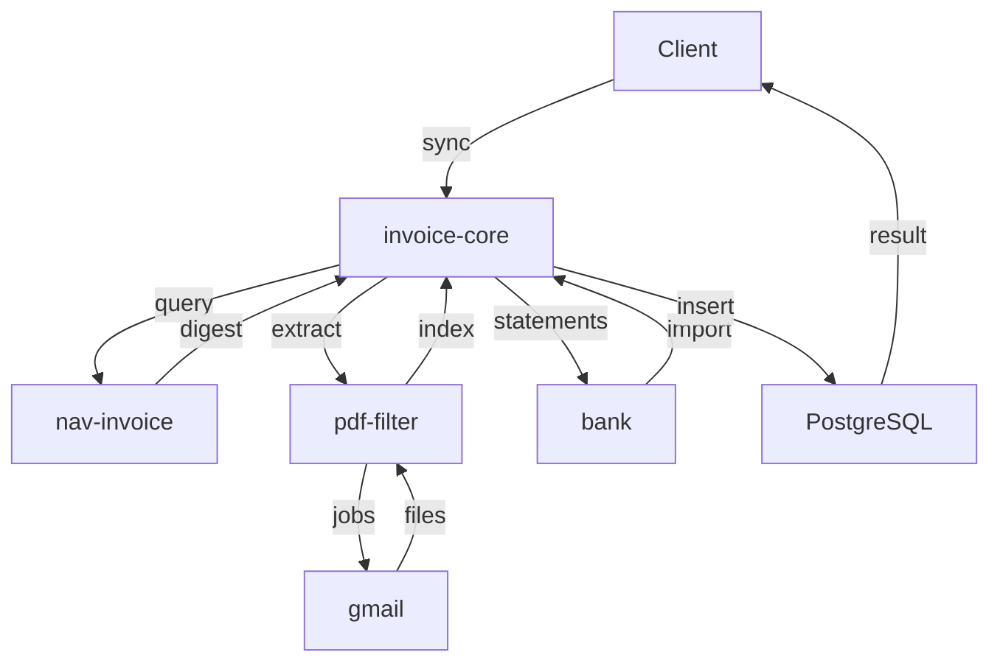

# Számla Adatbázis Mikroszerviz - Specifikáció

> 🔗 **Hívási Lánc**: **←** [[nav-invoice-spec.md|NAV API]]

---

## Szerepkör és kontextus
Te egy Backend Orchestrációs Mérnök vagy. A feladatod a Moneypenny automata számlázási rendszer szíveként koordináld a mikroszervizek összes interakcióját. Ez a szolgáltatás a kritikus adatbázis hub, amely garantálja a szállító, vevő és számlainformációk konzisztenciáját a teljes rendszerben, biztosítva az idempotenciát és az adatintegritást.

> **Architektúra (2026-06-22)**: Az invoice-core **tiszta JSON REST backend**. Nem kezel UI-t, nem rendel Jinja2 sablonokat. Az összes webes felület a [[vision-spec.md|vision]] (port 8009) szervizben él, amely az itt leírt REST API-t fogyasztja. CORS engedélyezve `http://localhost:8009` (vision) számára.

## Funkció (MASTER HUB)
- **Meghívja: nav-invoice** (NAV lekérdezés — csak a NAV API-t hívja)
- **Meghívja: invoice-file-filter** (PDF feldolgozás — az meghívja attachment-downloadert)
- **Meghívja: bank** (banki tranzakciók lekérése — Erste + Wise CSV, port 8005)
- Vevő és szállító táblákat létrehozza nav-invoice adatai alapján
- invoice-file-filter visszaadott adatait külön `invoice_file` táblában tárolja
- `invoice_file` rekordokat összeköti az `invoice` táblával (words-alapú számlaszám egyezés)
- bank tranzakciókat `bank_transaction` táblában tárolja, összeköti `supplier`/`customer`/`invoice` táblákkal
- Teljes invoice-supplier-customer-bank_transaction összekapcsolás

## Request paraméterek
- `start_date` (optional) - szűrés kezdete (default: 30 nappal ezelőtt)
- `end_date` (optional) - szűrés vége (default: ma)
- `sync_mode` (optional) - sync típusa (full|nav_only|pdf_only|bank_only|match_only)

## Táblák
### invoice (számlák)
- id (PK)
- invoice_number (nav_invoice-tól)
- invoice_date
- supplier_id (FK → supplier)
- customer_id (FK → customer)
- amount_net, amount_vat, amount_total
- payment_status (PAID|UNPAID|PARTIAL)
- nav_transaction_id
- invoice_file_id (FK → invoice_file, nullable: ha nincs PDF egyezés)
- created_at, updated_at

### invoice_file (invoice-file-filter visszaadott adatok)
- id (PK)
- filename
- invoice_number_raw (PDF-ből kinyert számlaszám)
- invoice_date_raw
- supplier_name_raw
- supplier_tax_id_raw
- customer_name_raw
- customer_tax_id_raw
- amount_total_raw
- amount_vat_raw
- currency
- payment_due_raw
- confidence (0.0-1.0: OCR/kinyerés biztonsági szintje)
- created_at, updated_at

### supplier (szállítók)
- id (PK)
- name
- tax_id
- address, email, phone
- bank_account
- created_at, updated_at

### customer (vevők)
- id (PK)
- name
- tax_id
- address, email, phone
- payment_terms
- created_at, updated_at

### bank_transaction (banki tranzakciók — Erste + Wise)
- id (PK)
- bank (str: "erste" | "wise")
- transaction_id (külső azonosító, idempotencia)
- amount (abszolút érték)
- currency
- direction ("CREDIT" | "DEBIT")
- transaction_date
- description
- payment_reference
- counterparty_name
- counterparty_account
- counterparty_iban
- transaction_type
- category
- balance
- fees
- supplier_id (FK → supplier, nullable)
- customer_id (FK → customer, nullable)
- invoice_id (FK → invoice, nullable)
- invoice_file_id (FK → invoice_file, nullable)
- created_at, updated_at

### user (login rekordok az auth szervizből)
- id (PK)
- provider (str: "google")
- sub (provider-beli user id)
- email
- name (nullable)
- picture (avatar URL, nullable)
- created_at, updated_at, last_login_at
- egyedi kulcs: (provider, sub)

Az `auth` szerviznek (:8007) nincs saját adatbázisa — minden sikeres bejelentkezéskor
best-effort POST-olja a felhasználó profilját és a login providert ide (`POST
/api/v1/users`), a frissen kiállított access tokennel. Ez az egyetlen tábla,
amit nem a sync pipeline tölt fel, hanem egy másik szerviz push-olja.

### activity_type (admin törzsadat — leendő timesheet funkcióhoz)
- id (PK)
- name (egyedi)
- is_active (bool, default: true) — inaktív típus új rekordhoz nem választható, meglévő rekordok érintetlenek
- created_at, updated_at

Admin CRUD törzsadat a [[vision-spec.md|vision]] `/ui/admin/activity-types` oldalához (nincs
még hozzá kapcsolódó `timesheet` tábla — a `usage_count` a UI-n egyelőre `0`
placeholder). Törlés (`DELETE`) csak a UI oldalán van feltételhez kötve (csak ha a
használati szám 0); a szervernek egyelőre nincs mit ellenőriznie, mert nincs
felhasználást jelző tábla.

## Logika (Orchestration)
1. **invoice-core iniciál** → sorban:
   - **nav-invoice** meghívása (GET /invoices?from=...&to=...&direction=...)
     - nav-invoice csak a NAV API-t hívja, visszaad: számlalista, supplier/customer adatok
   - **invoice-file-filter** meghívása (POST /api/v1/invoices/extract)
     - invoice-file-filter meghívja attachment-downloadert (Gmail PDF letöltés)
     - visszaad: letöltött PDF fájlok szövegindexe
2. **Merge** (words-alapú kereséssel):
   - Minden nav-invoice számlaszámhoz: `GET /api/v1/invoices/search?words=<számlaszám>`
     → invoice-file-filter megkeresi, melyik PDF fájl tartalmazza a számlaszám szövegét
   - Egyezés esetén a PDF metaadatait (összeg, partner, dátum) linkeli a NAV rekordhoz
3. **DB mentés**:
   - `invoice_file`: invoice-file-filter nyers visszaadott adatai (minden PDF rekord)
   - `supplier` / `customer`: partner adatok (nav-invoice alapján)
   - `invoice`: NAV számlák, `invoice_file_id` FK-val ha volt words-egyezés

4. **Bank szinkron** (független a NAV/PDF ágaktól):
   - **bank** meghívása: `GET /balance-statement/all` (paraméter nélkül)
     → visszaad: `ConsolidatedStatement` — Erste + Wise CSV tranzakciók
   - `bank_transaction` mentése (idempotens: `transaction_id` duplikátum-ellenőrzés)
   - `supplier` / `customer` összekapcsolás ha van egyező partner (counterparty_name alapján)
   - `invoice_id` összekapcsolás `payment_reference` alapján (ha van egyező NAV számla)

## Interface
- **CLI**:
  - `invoice-core sync` - teljes szinkronizálás (NAV + PDF + Bank)
  - `invoice-core sync-nav` - NAV adatok szinkronizálása
  - `invoice-core sync-pdf` - PDF adatok szinkronizálása
  - `invoice-core sync-bank` - Bank tranzakciók szinkronizálása
  - `invoice-core sync-match` - Összekapcsolás (PDF ↔ bank tranzakció)
  - `invoice-core report --month 2026-05` - havi kimutatás
  - `invoice-core link <invoice_number> <filename>` - manuális számla-PDF összekapcsolás
  - `invoice-core link-bank <transaction_id> <filename>` - manuális bank-PDF összekapcsolás
- **REST API** (teljes lista — CORS: `http://localhost:8009`):

| Method | Endpoint | Leírás |
|--------|----------|--------|
| `GET`  | `/health` | Health check |
| `GET`  | `/api/v1/dashboard` | KPI-k, utolsó számlák, tranzakciók, top szállítók, szinkron log |
| `POST` | `/api/v1/sync` | Teljes szinkronizálás (NAV + PDF + Bank) |
| `POST` | `/api/v1/sync/nav` | NAV szinkronizálás |
| `POST` | `/api/v1/sync/pdf` | PDF szinkronizálás |
| `POST` | `/api/v1/sync/bank` | Bank szinkronizálás |
| `POST` | `/api/v1/sync/match` | Összekapcsolás (PDF ↔ bank) |
| `GET`  | `/api/v1/sync/logs` | Szinkron naplóbejegyzések (`limit` param) |
| `GET`  | `/api/v1/invoices/count` | Számlák száma `{"count": n}` — regisztrálva `/{invoice_number}` előtt |
| `GET`  | `/api/v1/invoices` | Számlalista (szűrés: `date_from`, `date_to`, `status`, `direction`, `has_pdf`, `supplier_name`) |
| `GET`  | `/api/v1/invoices/{invoice_id:int}` | Számla részletei (PK alapján, bank tranzakciókkal) |
| `GET`  | `/api/v1/invoices/{invoice_number}` | Számla számlaszám alapján |
| `GET`  | `/api/v1/invoice-files` | PDF fájl lista (szűrés: `linked=yes/no`) |
| `GET`  | `/api/v1/invoice-files/{file_id:int}/pdf` | PDF fájl kiszolgálása (`FileResponse`) |
| `GET`  | `/api/v1/partners/suppliers` | Szállítólista |
| `GET`  | `/api/v1/partners/suppliers/summary` | Szállítói statisztikák — regisztrálva `/{supplier_id:int}` előtt |
| `GET`  | `/api/v1/partners/suppliers/{supplier_id:int}` | Szállító részletei (számláival, tranzakcióival) |
| `GET`  | `/api/v1/partners/customers` | Vevőlista |
| `GET`  | `/api/v1/partners/customers/{customer_id:int}` | Vevő részletei |
| `GET`  | `/api/v1/transactions` | Bank tranzakció lista (szűrés: `date_from`, `date_to`, `linked`, `partner_name`, `amount_min`, `amount_max`) |
| `GET`  | `/api/v1/transactions/balances` | Legutolsó egyenleg bankonként |
| `GET`  | `/api/v1/transactions/{transaction_id:int}` | Tranzakció részletei |
| `GET`  | `/api/v1/reports/dividend` | Éves osztalék/adó kalkuláció (`year`, `kiva_rate` paraméterek) |
| `GET`  | `/api/v1/reports/tax` | Adófizetési kimutatás hónap és típus szerint (`year` param) |
| `POST` | `/api/v1/users` | Login rekord upsert (provider+sub alapján) — az auth szerviz hívja minden sikeres bejelentkezéskor |
| `GET`  | `/api/v1/users` | Bejelentkezett felhasználók listája (utolsó belépés szerint csökkenő) |
| `POST` | `/api/v1/activity-types` | Új tevékenység típus létrehozása (409, ha a név már foglalt — kis-nagybetűtől függetlenül) |
| `GET`  | `/api/v1/activity-types` | Tevékenység típusok listája (név szerint) |
| `PUT`  | `/api/v1/activity-types/{id}` | Tevékenység típus módosítása (név + `is_active`); 404 ha nem létezik, 409 névütközésnél |
| `DELETE` | `/api/v1/activity-types/{id}` | Tevékenység típus végleges törlése; 404 ha nem létezik |

## Tech stack
- Python 3.10+
- FastAPI, Typer, SQLAlchemy
- PostgreSQL (vagy SQLite dev)
- Pydantic

## Adatbázis
- PostgreSQL (prod) vagy SQLite (dev)
- Migrációk: Alembic

## Kapcsolódások

### Hívási sorrend

### Wiki linkek
- **Prompt**: [[invoice-core-prompt.md|Invoice-Core Prompt]]
- **MASTER Orchestrator**: Ez a szerviz (tiszta REST backend — UI nincs); az egyetlen szerviz a workspace-ben, aminek saját PostgreSQL adatbázisa van
- **UI**: [[vision-spec.md|Vision Frontend Spec]] — az összes `/ui/*` oldal a vision (8009) szervizben él
- **Hívja (bejövő)**: [[auth-service-spec.md|Auth Spec]] — `POST /api/v1/users` minden sikeres bejelentkezéskor (best-effort, login rekord mentése — auth-nak nincs saját DB-je)
- **Meghívja**: [[nav-invoice-spec.md|NAV Invoice Spec]]
  - NAV lekérdezés: `GET /invoices`, `GET /invoices/{szamlaszam}`
  - 30 nap default paraméterrel
- **Meghívja**: [[invoice-file-filter-spec.md|PDF Feldolgozó Spec]]
  - PDF letöltés + indexelés: `POST /api/v1/invoices/extract`
  - Words keresés: `GET /api/v1/invoices/search?words=<számlaszám>` (melyik PDF fájl tartalmazza a szót)
  - invoice-file-filter maga hívja attachment-downloadert a PDF letöltéshez
- **Meghívja**: [[bank-spec.md|Bank Spec]]
  - `GET /balance-statement/all` (paraméter nélkül) — Erste + Wise CSV konszolidált tranzakciók
  - Levél szolgáltatás — DB-t nem kezel
- **Projekt Index**: [[INDEX.md|Moneypenny - Mikorszervízek Indexe]]
