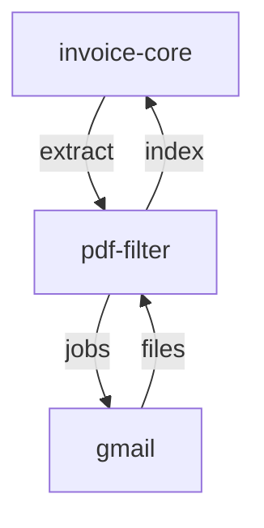

# PDF Számla Feldolgozó Mikroszerviz - Specifikáció

> 🔗 **Hívási Lánc**: [[nav-invoice-spec.md|← NAV API]] **→** [[attachment-downloader-spec.md|Gmail Letöltő →]]

---

## Szerepkör és kontextus
Te egy adatkinyerési szakember (Data Extraction Engineer) vagy. A feladatod PDF dokumentumokból strukturált számlaadatokat nyerni ki és validálni. Ez a szolgáltatás a számlákat felismerési pontosságért optimalizálja, és megbízható metaadatokat szállít a `invoice-core` orchestratornak, amely összeköti a NAV adatokkal.

## Funkció
- **Meghívja: attachment-downloader** (utolsó 30 nap default)
- Letöltött PDF fájlokból számlákat kiválogatja
- Számla metaadatokat nyeri ki (OCR/szabályok)
- Meghívott a nav-invoice által

## Kimeneti metaadatok
```json
{
  "filename": "2026-05-001_szamla.pdf",
  "invoice_number": "2026-001",
  "invoice_date": "2026-05-01",
  "supplier_name": "ABC Kft.",
  "supplier_tax_id": "12345678-1-01",
  "customer_name": "XYZ Bt.",
  "customer_tax_id": "87654321-2-02",
  "amount_total": 100000,
  "amount_vat": 27000,
  "currency": "HUF",
  "payment_due": "2026-05-31",
  "confidence": 0.95
}
```

## Input (opciók)
- `start_date` (optional) - szűrés kezdete (default: 30 nappal ezelőtt)
- `end_date` (optional) - szűrés vége (default: ma)
- `output_dir` (optional) - PDF könyvtár (default: ./downloads/)
- Batch feldolgozás támogatás

## API hívások
- attachment-downloader API: `GET /api/v1/jobs?status=completed` → PDF-ek letöltésének lekérdezése
- Letöltött PDF-ek feldolgozása az output_dir-ből

## Interface
- **CLI**: 
  - `invoice-file-filter process` (utolsó 30 nap, default)
  - `invoice-file-filter process --start 2026-05-01 --end 2026-05-31`
  - `invoice-file-filter process --output-dir /path/to/pdfs/`
- **REST API**:
  - `POST /api/v1/invoices/extract` - metaadatok kinyerése (attachment-downloader integrációval)
  - `POST /api/v1/invoices/extract-batch` - batch feldolgozás
  - `GET /api/v1/invoices` - feldolgozási történet

## Tech stack
- Python 3.10+
- FastAPI, Typer
- PyPDF2/pdfplumber (PDF parse)
- Regex/spaCy (adatkinyerés)
- Tesseract OCR (opcionális: beszkennelt PDF)

## Logika
1. PDF-t megnyitja
2. Szöveg kinyerése
3. Regex/szabályok: számlaszám, dátum, összeg, TAX ID
4. Metaadatok JSON-ként
5. Confidence score kalkulálása

---

## Kapcsolódások

### Hívási sorrend



### Wiki linkek
- **Prompt**: [[invoice-file-filter-prompt.md|PDF Feldolgozó Prompt]]
- **Meghívva**: [[nav-invoice-spec.md|NAV Invoice Spec]]
- **Meghívom**: [[attachment-downloader-spec.md|Attachment Downloader Spec]]
  - attachment-downloader meghívása (POST /api/v1/jobs)
  - utolsó 30 nap default paraméterrel
- **MASTER Orchestrator**: [[invoice-core-spec.md|Invoice-Core Spec]]
- **Projekt Index**: [[INDEX.md|Moneypenny - Mikorszervízek Indexe]]
