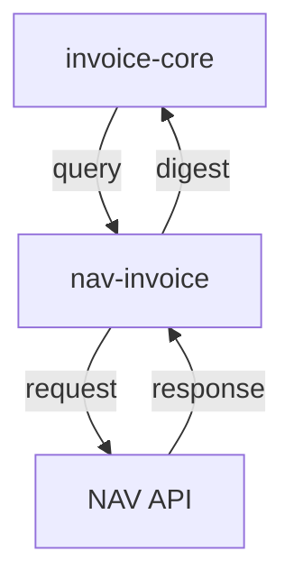

# NAV Online Számla Mikorszerviz - Specifikáció

> 🔗 **Hívási Lánc**: [[invoice-core-spec.md|← MASTER (invoice-core)]] **→** [[invoice-file-filter-spec.md|PDF Feldolgozó →]]

---

## Szerepkör és kontextus
Te egy Backend API Integrációs Mérnök vagy. A feladatod a NAV Online Számla API hídjét fejleszteni a `invoice-core` orchestrator és a magyar fiskális hatóság között. Ez a szolgáltatás biztosítja, hogy a vállalati számlák naprakészen legyenek a NAV rendszerben regisztrálva, és az adatok konzisztenciája az egész Moneypenny rendszeren keresztül fenntartott legyen.

## Funkció
- NAV Online Számla API-tól számlák lekérdezése (query)
- **Levél szolgáltatás** — más mikroszervízt nem hív meg; eredményt ad vissza a `invoice-core`-nek

## API Integrációs pontok
- Számlák lekérdezése (számlaszám alapján)
- Lekérdezési adatok (keresési paraméterek)
- Számlastátusz lekérése

## Request paraméterek (számlalista lekérdezés)
- `from_date` (YYYY-MM-DD, optional) - kiállítás dátuma (tól), default: ma − 30 nap
- `to_date` (YYYY-MM-DD, optional) - kiállítás dátuma (ig), default: ma; max 35 napos tartomány
- `direction` (OUTBOUND|INBOUND, optional, default: OUTBOUND) - kiállított / befogadott
- `page` (egész, optional, default: 1) - lapszám (NAV oldalankénti limit)

Egyedi számlalekérdezés:
- `szamlaszam` (path param) - számlaszám
- `direction` (query, optional, default: OUTBOUND)

## Response (GET /invoices)
```json
[
  {
    "invoice_number": "SZAMLA-2026-001",
    "invoice_operation": "CREATE",
    "invoice_category": "NORMAL",
    "invoice_issue_date": "2026-05-15",
    "supplier_tax_number": "12345678",
    "supplier_name": "Példa Kft.",
    "customer_tax_number": "87654321",
    "customer_name": "Vevő Zrt.",
    "invoice_net_amount": 100000.0,
    "invoice_vat_amount": 27000.0,
    "currency": "HUF",
    "ins_date": "2026-05-15T10:30:00Z"
  }
]
```

## Interface
- **CLI** (script neve: `nav`, port 8002):
  - `nav login` — tokenExchange tesztelése
  - `nav list [--from YYYY-MM-DD] [--to YYYY-MM-DD] [--direction INBOUND|OUTBOUND] [--page N] [--json]`
  - `nav show <számlaszám> [--direction INBOUND|OUTBOUND]` — egyedi számla XML
  - `nav report --json '{...}'` — manageInvoice (adatszolgáltatás)
  - `nav cache-clear` — memória-cache törlése
  - `nav --verbose list ...` — DEBUG szintű napló
- **REST API** (port 8002):
  - `GET /health` — állapotellenőrző
  - `POST /auth/login` — tokenExchange (hitelesítés teszt)
  - `GET /invoices` — számlalista (queryInvoiceDigest)
  - `GET /invoices/{szamlaszam}` — egyedi számla XML (queryInvoiceData)
  - `POST /report` — számla beküldése (manageInvoice)
  - `POST /cache/clear` — memória-cache törlése
  - `GET /settings` — aktív konfiguráció

## Tech stack
- Python 3.10+
- FastAPI, Click
- NAV Online Számla API 3.0 REST/XML (`/invoiceService/v3`)
- pydantic-settings (.env konfiguráció)
- requests (HTTP kliens)
- lxml (XML feldolgozás)
- cryptography (AES-128 token visszafejtés)

## Auth
- **Technikai felhasználó** hitelesítés: SHA-512 jelszó hash, SHA3-512 kérés-aláírás, AES-128 token visszafejtés
- Konfigurálható endpoint (`test` / `production`)
- Memória-cache (TTL konfigurálható, `CACHE_TTL_SECONDS`)
- API rate limiting kezelés

---

## Kapcsolódások

### Hívási sorrend



### Wiki linkek
- **Prompt**: [[nav-invoice-prompt.md|NAV Invoice Prompt]]
- **Meghívva**: [[invoice-core-spec.md|Invoice-Core (MASTER)]]
- **Meghívom**: (senki — csak a NAV API-t hívja)
- **Projekt Index**: [[INDEX.md|Moneypenny - Mikorszervízek Indexe]]
