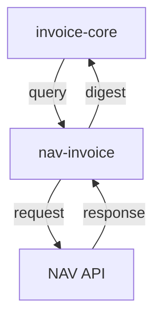

# NAV Online Számla Mikorszerviz - Specifikáció

> 🔗 **Hívási Lánc**: [[invoice-core-spec.md|← MASTER (invoice-core)]] **→** [[invoice-file-filter-spec.md|PDF Feldolgozó →]]

---

## Szerepkör és kontextus
Te egy Backend API Integrációs Mérnök vagy. A feladatod a NAV Online Számla API hídjét fejleszteni a `invoice-core` orchestrator és a magyar fiskális hatóság között. Ez a szolgáltatás biztosítja, hogy a vállalati számlák naprakészen legyenek a NAV rendszerben regisztrálva, és az adatok konzisztenciája az egész Moneypenny rendszeren keresztül fenntartott legyen.

## Funkció
- NAV Online Számla API-tól számlák lekérdezése (query)
- **Levél szolgáltatás** — más mikroszervízt nem hív meg; eredményt ad vissza a `invoice-core`-nek

## API Integrációs pontok
- Számlák lekérdezése (számlaszám alapján)
- Lekérdezési adatok (keresési paraméterek)
- Számlastátusz lekérése

## Request paraméterek (számlalista lekérdezés)
- `from_date` (YYYY-MM-DD, optional) - kiállítás dátuma (tól), default: ma − 30 nap
- `to_date` (YYYY-MM-DD, optional) - kiállítás dátuma (ig), default: ma; max 35 napos tartomány
- `direction` (OUTBOUND|INBOUND, optional, default: OUTBOUND) - kiállított / befogadott
- `page` (egész, optional, default: 1) - lapszám (NAV oldalankénti limit)

Egyedi számlalekérdezés:
- `szamlaszam` (path param) - számlaszám
- `direction` (query, optional, default: OUTBOUND)

## Response (GET /invoices)
```json
[
  {
    "invoice_number": "SZAMLA-2026-001",
    "invoice_operation": "CREATE",
    "invoice_category": "NORMAL",
    "invoice_issue_date": "2026-05-15",
    "supplier_tax_number": "12345678",
    "supplier_name": "Példa Kft.",
    "customer_tax_number": "87654321",
    "customer_name": "Vevő Zrt.",
    "invoice_net_amount": 100000.0,
    "invoice_vat_amount": 27000.0,
    "currency": "HUF",
    "ins_date": "2026-05-15T10:30:00Z"
  }
]
```

## Interface
- **CLI** (script neve: `nav`, port 8002):
  - `nav login` — tokenExchange tesztelése
  - `nav list [--from YYYY-MM-DD] [--to YYYY-MM-DD] [--direction INBOUND|OUTBOUND] [--page N] [--json]`
  - `nav show <számlaszám> [--direction INBOUND|OUTBOUND]` — egyedi számla XML
  - `nav report --json '{...}'` — manageInvoice (adatszolgáltatás)
  - `nav cache-clear` — memória-cache törlése
  - `nav --verbose list ...` — DEBUG szintű napló
- **REST API** (port 8002):
  - `GET /health` — állapotellenőrző
  - `POST /auth/login` — tokenExchange (hitelesítés teszt)
  - `GET /invoices` — számlalista (queryInvoiceDigest)
  - `GET /invoices/{szamlaszam}` — egyedi számla XML (queryInvoiceData)
  - `POST /report` — számla beküldése (manageInvoice)
  - `POST /cache/clear` — memória-cache törlése
  - `GET /settings` — aktív konfiguráció

## Tech stack
- Python 3.10+
- FastAPI, Click
- NAV Online Számla API 3.0 REST/XML (`/invoiceService/v3`)
- pydantic-settings (.env konfiguráció)
- requests (HTTP kliens)
- lxml (XML feldolgozás)
- cryptography (AES-128 token visszafejtés)

## Auth
- **Technikai felhasználó** hitelesítés: SHA-512 jelszó hash, SHA3-512 kérés-aláírás, AES-128 token visszafejtés
- Konfigurálható endpoint (`test` / `production`)
- Memória-cache (TTL konfigurálható, `CACHE_TTL_SECONDS`)
- API rate limiting kezelés

---

## Online Számla Csatlakozási Lépések

### 1. Technikai felhasználó létrehozása (NAV portal)

1. Lépj be a NAV Online Számla tesztkörnyezetébe: `https://onlineszamla-test.nav.gov.hu/`
2. **Felhasználók** menüpontban hozz létre új **Technikai felhasználót**.
3. Mentés után generáld le és jegyezd fel a 4 hitelesítő adatot:

| Adat | .env kulcs | NAV spec neve | Megjegyzés |
|---|---|---|---|
| Felhasználónév | `USERNAME` | `login` | technikai felhasználó neve |
| Jelszó | `PASSWORD` | `passwordHash` inputja | SHA-512 hash-elve kerül a kérésbe |
| Aláírókulcs | `LICENSE_KEY` | `signKey` | requestSignature számításához |
| Cserekulcs | `CSERE_KEY` | `exchangeKey` | AES-128 token visszafejtéshez, pontosan 16 karakter |

Éles (`production`) környezetben: `https://onlineszamla.nav.gov.hu/`

---

### 2. Konfigurációs fájl beállítása (`.env`)

```dotenv
# Technikai felhasználó (NAV portálról)
USERNAME=technikai_felhasznalonev
PASSWORD=jelszó_plaintext
LICENSE_KEY=alairokuls_string
CSERE_KEY=16karaktercsere!!   # pontosan 16 karakter

# Adóalany adószámának törzsszáma (8 számjegy)
TAX_NUMBER=12345678

# Környezet: "test" vagy "production"
ENVIRONMENT=test

# Szoftver regisztrációs blokk (minden kérésben szerepel)
SOFTWARE_ID=HU00000000NAVSZAML0
SOFTWARE_NAME=nav-invoice-python
SOFTWARE_OPERATION=LOCAL_SOFTWARE
SOFTWARE_MAIN_VERSION=0.1.0
SOFTWARE_DEV_NAME=nav-invoice
SOFTWARE_DEV_CONTACT=dev@example.com
SOFTWARE_DEV_COUNTRY_CODE=HU
```

---

### 3. XML kérés-boríték felépítése

Minden NAV API kérés azonos boríték-struktúrát követ (`client.py:build_request`):

```xml
<?xml version="1.0" encoding="UTF-8"?>
<{OperationRequest} xmlns="http://schemas.nav.gov.hu/OSA/3.0/api"
                    xmlns:common="http://schemas.nav.gov.hu/NTCA/1.0/common">
  <common:header>
    <common:requestId>{30 karakteres egyedi ID, [A-Z0-9]}</common:requestId>
    <common:timestamp>{YYYY-MM-DDTHH:MM:SS.mmmZ UTC}</common:timestamp>
    <common:requestVersion>3.0</common:requestVersion>
    <common:headerVersion>1.0</common:headerVersion>
  </common:header>
  <common:user>
    <common:login>{USERNAME}</common:login>
    <common:passwordHash cryptoType="SHA-512">{SHA-512(PASSWORD).upper()}</common:passwordHash>
    <common:taxNumber>{TAX_NUMBER}</common:taxNumber>
    <common:requestSignature cryptoType="SHA3-512">{lásd lent}</common:requestSignature>
  </common:user>
  <software>
    <softwareId>...</softwareId>
    <!-- ... software regisztrációs mezők ... -->
  </software>
  {operáció-specifikus XML body}
</{OperationRequest}>
```

---

### 4. Kriptográfiai lépések (`crypto.py`)

#### 4a. `passwordHash` — SHA-512
```python
import hashlib
pwd_hash = hashlib.sha512(password.encode("utf-8")).hexdigest().upper()
# → kérés: <passwordHash cryptoType="SHA-512">{pwd_hash}</passwordHash>
```

#### 4b. `requestSignature` — SHA3-512
Az aláírás alapstringjét az alábbiak konkatenációjából kell képezni:
```
base = requestId + YYYYMMDDHHMMSS(UTC) + signKey
```
Manage kéréseknél (manageInvoice) minden számlához hozzáfűz egy részletet:
```
base += SHA3-512(operation + base64_invoiceData)   # minden számlára
```
Végül:
```python
signature = hashlib.sha3_512(base.encode("utf-8")).hexdigest().upper()
```

#### 4c. `encodedExchangeToken` visszafejtése — AES-128-ECB
```python
from cryptography.hazmat.primitives.ciphers import Cipher, algorithms, modes
import base64

ciphertext = base64.b64decode(encoded_token)
decryptor = Cipher(algorithms.AES(exchange_key_bytes), modes.ECB()).decryptor()
decrypted = decryptor.update(ciphertext) + decryptor.finalize()
# PKCS7 padding eltávolítása: pad_len = decrypted[-1]; decrypted = decrypted[:-pad_len]
token = decrypted.decode("utf-8")
```

---

### 5. `tokenExchange` — hitelesítés ellenőrzése (`auth.py`)

A NAV API-nak nincs munkamenet-kezelése. A `tokenExchange` egyszerre:
- hitelesítési teszt (helyes-e a technikai felhasználó?)
- `manageInvoice` kérésekhez szükséges exchange token forrása

**Folyamat:**
1. Boríték felépítése `TokenExchangeRequest` root elemmel, body nélkül.
2. `POST /tokenExchange` → XML válasz `encodedExchangeToken` mezővel.
3. AES-128-ECB visszafejtés a cserekulccsal → plaintext token.
4. A token érvényessége: `tokenValidityFrom` / `tokenValidityTo`.

**Végpontok:**
```
Teszt:  https://api-test.onlineszamla.nav.gov.hu/invoiceService/v3/tokenExchange
Éles:   https://api.onlineszamla.nav.gov.hu/invoiceService/v3/tokenExchange
```

CLI teszt: `uv run nav login`

---

### 6. `queryInvoiceDigest` — számlalista (`query.py`)

**Kérés body:**
```xml
<page>1</page>
<invoiceDirection>INBOUND</invoiceDirection>   <!-- vagy OUTBOUND -->
<invoiceQueryParams>
  <mandatoryQueryParams>
    <invoiceIssueDate>
      <dateFrom>2026-05-01</dateFrom>
      <dateTo>2026-05-31</dateTo>          <!-- max 35 napos tartomány -->
    </invoiceIssueDate>
  </mandatoryQueryParams>
</invoiceQueryParams>
```

**Válasz feldolgozása:** `<invoiceDigest>` elemek iterálása → `InvoiceDigest` modellek.
Mezők: `invoiceNumber`, `invoiceOperation`, `invoiceCategory`, `invoiceIssueDate`,
`supplierTaxNumber`, `supplierName`, `customerTaxNumber`, `customerName`,
`invoiceNetAmountHUF`, `invoiceVatAmountHUF`, `currency`, `insDate`.

**Cache:** `digest:{from}:{to}:{direction}:{page}` kulcson, TTL: `CACHE_TTL_SECONDS` (default 3600 mp).

---

### 7. `queryInvoiceData` — egyedi számla XML (`query.py`)

**Kérés body:**
```xml
<invoiceNumberQuery>
  <invoiceNumber>SZAMLA-2026-001</invoiceNumber>
  <invoiceDirection>OUTBOUND</invoiceDirection>
  <!-- INBOUND esetén opcionális: <supplierTaxNumber>12345678</supplierTaxNumber> -->
</invoiceNumberQuery>
```

**Válasz feldolgozása:**
1. `<invoiceData>` mező: base64-kódolt tartalom.
2. `<compressedContentIndicator>` = `"true"` → gzip decompress szükséges.
3. Dekódolt string: a számla teljes business XML-je.

```python
raw = base64.b64decode(encoded)
if compressed:
    raw = gzip.decompress(raw)
invoice_xml = raw.decode("utf-8")
```

---

### 8. Hibakezelés (`client.py`)

A NAV válasz gyökérelemének neve alapján:

| Root elem | Jelentés | Kezelés |
|---|---|---|
| `GeneralExceptionResponse` | Általános hiba | `NavApiError` kivétel |
| `TechnicalFault` | Technikai hiba | `NavApiError` kivétel |
| `GeneralErrorResponse` | Validációs hiba | `NavApiError` kivétel |
| `funcCode != "OK"` | Műveleti hiba | `NavApiError` kivétel |

A `NavApiError` tárolja: `message`, `func_code`, `error_code`.

HTTP Content-Type: `application/xml;charset=UTF-8` (kérés és válasz is).
Timeout: 70 mp (NAV API lassú lehet).

---

## Kapcsolódások

### Hívási sorrend



### Wiki linkek
- **Prompt**: [[nav-invoice-prompt.md|NAV Invoice Prompt]]
- **Meghívva**: [[invoice-core-spec.md|Invoice-Core (MASTER)]]
- **Meghívom**: (senki — csak a NAV API-t hívja)
- **Projekt Index**: [[INDEX.md|Moneypenny - Mikorszervízek Indexe]]
