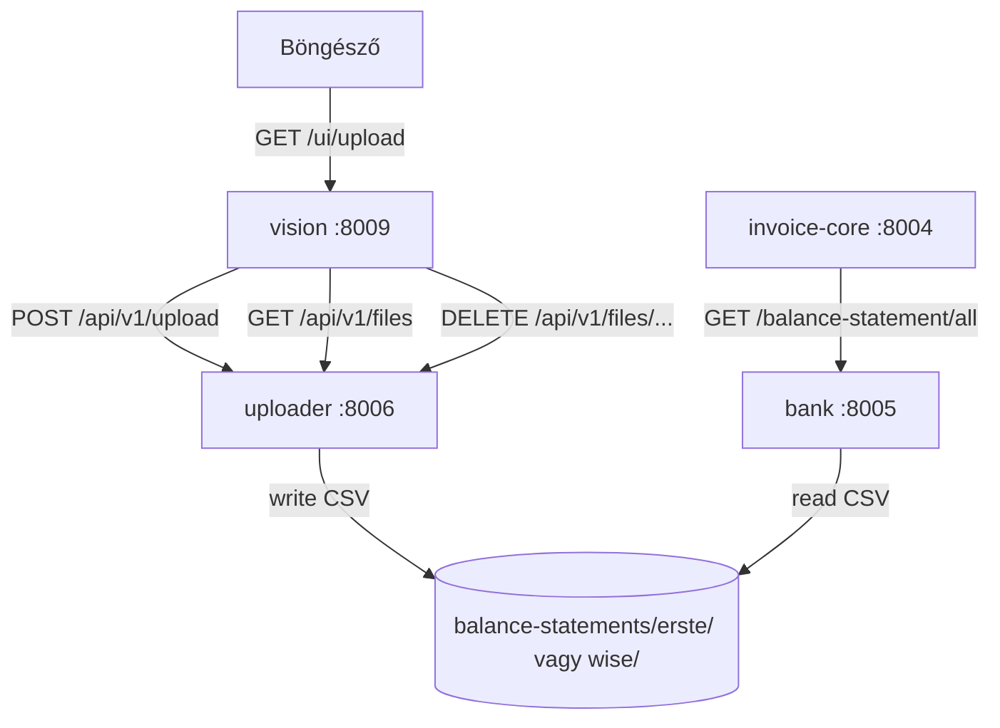

# Uploader – Bankkivonat Feltöltő Szolgáltatás — Specifikáció

> 🔗 **Kapcsolat**: feltöltött fájlokat [[bank-spec.md|Bank szerviz]] (port 8005) olvassa; UI [[vision-spec.md|Vision]] (port 8009) kiszolgálja

---

## Szerepkör és kontextus

Az Uploader egy önálló leaf mikroszerviz, amely webes felületen keresztül lehetővé teszi az Erste és Wise CSV bankkivonatok feltöltését a bank szerviz `balance-statements/` tároló mappájába. Nincs adatbázisa — csak fájlrendszert kezel.

**Probléma**: A `bank` szerviz jelenleg azt feltételezi, hogy a CSV kivonatok kézzel kerülnek a `balance-statements/erste/` ill. `balance-statements/wise/` alkönyvtárba. Az Uploader webes feltöltési UI-t biztosít ehhez.

**UI elhelyezése**: A feltöltési felület a `vision` szervizben van (`/ui/upload`). A vision közvetlenül az uploader REST API-ját hívja multipart file upload-hoz.

**Hívási lánc**:
```
Böngésző → Vision (/ui/upload) → Uploader (POST /api/v1/upload) → balance-statements/{bank}/*.csv
                                                                         ↓
                                                               Bank szerviz olvassa
```

---

## Fájl-felderítés és bankdetektálás

A banktípust a fájlnévből kell meghatározni — pontosan ugyanolyan séma szerint, ahogy a `bank` szerviz feldolgozza:

| Bank | Fájlnév-séma | Példa |
|---|---|---|
| Erste | `<számlaszám>_<YYYY-MM-DD>_<YYYY-MM-DD>.csv` | `11600006-00000001-97860425_2026-01-01_2026-06-19.csv` |
| Wise | `statement_<balanceId>_<currency>_<YYYY-MM-DD>_<YYYY-MM-DD>.csv` | `statement_25546267_HUF_2026-01-01_2026-06-17.csv` |

Detektálási logika (prioritás sorrendben):
1. Ha a fájlnév `statement_`-tal kezdődik → **Wise**
2. Ha a fájlnév dátum-mintájú végű (`_YYYY-MM-DD_YYYY-MM-DD.csv`) és nem `statement_`-tal kezdődik → **Erste**
3. Egyéb → validációs hiba, feltöltés elutasítva

---

## Adatmodellek

### `UploadResult`

```python
class UploadResult(BaseModel):
    filename: str           # mentett fájlnév
    bank: str               # "erste" | "wise"
    saved_path: str         # teljes elérési út a storage-ban
    size_bytes: int
    overwritten: bool       # igaz, ha azonos nevű fájl már létezett
```

### `StorageFile`

```python
class StorageFile(BaseModel):
    bank: str               # "erste" | "wise"
    filename: str
    size_bytes: int
    modified_at: datetime
    path: str
```

### `StorageStatus`

```python
class StorageStatus(BaseModel):
    storage_dir: str
    banks: dict[str, list[StorageFile]]   # {"erste": [...], "wise": [...]}
    total_files: int
```

---

## REST API (port 8006)

| Method | Endpoint | Leírás |
|---|---|---|
| `GET` | `/health` | állapotellenőrzés |
| `GET` | `/settings` | aktív konfiguráció |
| `GET` | `/api/v1/files` | tárolt fájlok listája (minden bank) |
| `GET` | `/api/v1/files/{bank}` | adott bank fájljai (`erste` / `wise`) |
| `POST` | `/api/v1/upload` | CSV feltöltése (multipart/form-data) |
| `DELETE` | `/api/v1/files/{bank}/{filename}` | fájl törlése |

### `POST /api/v1/upload`

**Request**: `multipart/form-data`

| Mező | Típus | Kötelező | Leírás |
|---|---|---|---|
| `file` | `UploadFile` | igen | CSV fájl |
| `bank` | `str` | nem | `erste` \| `wise` — ha megadva, felülírja az automatikus detektálást |
| `overwrite` | `bool` | nem (default: `false`) | létező fájl felülírása |

**Response** `200 OK`: `UploadResult`

**Hibák**:
- `400` — nem CSV fájl, nem felismerhető formátum, `overwrite=false` és fájl már létezik
- `422` — hiányzó/érvénytelen mező

**Példa response**:

```json
{
  "filename": "11600006-00000001-97860425_2026-01-01_2026-06-19.csv",
  "bank": "erste",
  "saved_path": "/opt/bank/balance-statements/erste/11600006-00000001-97860425_2026-01-01_2026-06-19.csv",
  "size_bytes": 48320,
  "overwritten": false
}
```

### `GET /api/v1/files`

**Response** `200 OK`: `StorageStatus`

```json
{
  "storage_dir": "/opt/bank/balance-statements",
  "banks": {
    "erste": [
      {
        "bank": "erste",
        "filename": "11600006-00000001-97860425_2026-01-01_2026-06-19.csv",
        "size_bytes": 48320,
        "modified_at": "2026-06-24T10:30:00",
        "path": "/opt/bank/balance-statements/erste/11600006-00000001-97860425_2026-01-01_2026-06-19.csv"
      }
    ],
    "wise": []
  },
  "total_files": 1
}
```

---

## CLI (script neve: `uploader`)

```bash
uploader status                            # storage mappa + fájlok összesítése
uploader list [--bank erste|wise|all]      # elérhető fájlok listázása
uploader upload <fájl> [--bank erste|wise] [--overwrite]  # fájl feltöltése
uploader delete <bank> <fájlnév>           # fájl törlése
```

---

## Vision UI bővítés

A vision szerviz kap egy új oldalt és egy új router bejegyzést.

### Új route: `GET /ui/upload`

**Template**: `upload.html`

**Tartalom**:
- Drag & drop vagy fájlböngésző (`<input type="file" accept=".csv">`)
- Bankdetektálás preview: feltöltés előtt kliensoldalon fájlnévből (JavaScript)
- `Overwrite` checkbox
- `POST` → uploader `POST /api/v1/upload` (vision közvetlenül hívja az uploader API-t)
- Eredmény: sikeres/hibás feltöltés jelzése (Bootstrap alert)
- Jelenlegi fájlok listája (`GET /api/v1/files`) — táblázatban, törölhető sorokkal (HTMX DELETE)

### Navbar bővítés

A `_sidebar.html`-be felvenni:
```
📤 Feltöltés  →  /ui/upload
```

### Vision kliens bővítés

`clients/uploader.py` — `UploaderClient`:

```python
class UploaderClient:
    def upload_file(self, file_bytes: bytes, filename: str, bank: str | None = None, overwrite: bool = False) -> UploadResult: ...
    def list_files(self) -> StorageStatus: ...
    def delete_file(self, bank: str, filename: str) -> None: ...
```

---

## Projektstruktúra

```
uploader/
├── src/uploader/
│   ├── __init__.py
│   ├── config.py          # pydantic-settings, .env
│   ├── models.py          # UploadResult, StorageFile, StorageStatus
│   ├── detector.py        # bankdetektálás fájlnévből
│   ├── storage.py         # fájl mentés / lista / törlés
│   ├── api/
│   │   └── main.py        # FastAPI app
│   └── cli/
│       └── main.py        # Typer CLI
├── pyproject.toml
├── run_api.py
└── .env
```

---

## Tech stack

- Python 3.11+
- FastAPI (`python-multipart` a file upload-hoz)
- Typer, Rich
- Pydantic v2
- pydantic-settings (`.env` konfiguráció)

---

## Environment (`.env`)

```env
# Megegyezik a bank szerviz BALANCE_STATEMENTS_DIR-jével
STORAGE_DIR=../bank/balance-statements   # az uploader és bank közös könyvtár
ERSTE_SUBDIR=erste
WISE_SUBDIR=wise
MAX_FILE_SIZE_MB=50
API_HOST=0.0.0.0
API_PORT=8006
LOG_LEVEL=INFO
```

> **Fontos**: `STORAGE_DIR` ugyanaz a könyvtár, mint a `bank` szerviz `BALANCE_STATEMENTS_DIR`-je. Dev környezetben relatív elérési úttal konfigurálható; prodban abszolút út ajánlott.

---

## Implementációs sorrend

1. `config.py` + `models.py` — pydantic-settings + modellek
2. `detector.py` — Erste/Wise fájlnév detektálás (regex)
3. `storage.py` — fájl mentés, lista, törlés a konfigurált mappában
4. `api/main.py` — FastAPI: `/health`, `/settings`, `/api/v1/files`, `/api/v1/upload`, `/api/v1/files/{bank}/{filename}` DELETE
5. `cli/main.py` — Typer CLI: `status`, `list`, `upload`, `delete`
6. Vision bővítés:
   - `clients/uploader.py` — UploaderClient
   - `ui/invoice_router.py` — `GET /ui/upload` route hozzáadása
   - `templates/upload.html` — feltöltési oldal (Bootstrap + HTMX)
   - `templates/_sidebar.html` — Feltöltés menüpont

---

## Kapcsolódások



---

## Wiki Linkek

- **Prompt**: [[uploader-promp.md|Uploader Prompt]]
- **Tárolt fájlokat olvassa**: [[bank-spec.md|Bank Spec]] (port 8005)
- **UI helye**: [[vision-spec.md|Vision Spec]] (port 8009, `/ui/upload` oldal)
- **Projekt Index**: [[INDEX.md|Moneypenny Index]]
