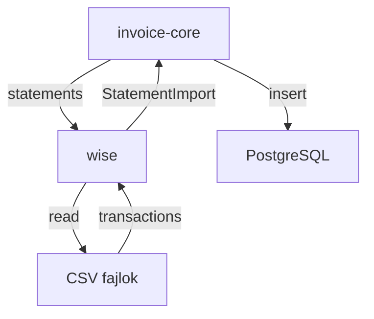

# Wise Banki Mikroszerviz - Specifikáció

> 🔗 **Hívási Lánc**: [[invoice-core-spec.md|← MASTER (invoice-core)]]

---

## Szerepkör és kontextus
Te egy Backend API Integrációs Mérnök vagy. A feladatod a Wise bankkivonatok feldolgozásának hídját fejleszteni a `invoice-core` orchestrator és a Wise rendszer között. Ez a szolgáltatás nem ír adatbázisba, az adatokat strukturáltan adja vissza a `invoice-core`-nek.

## Funkció
- Wise webfelületről **kézzel letöltött** kivonat CSV-ket (`balance-statements/` mappa) dolgoz fel
- Adatbázist nem kezel; strukturált tranzakció listát ad vissza a `invoice-core`-nek
- A `POST /sync` (élő Wise API hívás) egyelőre nem működik — a `invoice-core` a `/balance-statements` végpontot használja

---

## Wise API Csatlakozási Lépések

### 1. Előfeltételek

| Szükséges | Honnan |
|---|---|
| `WISE_API_KEY` | Wise webfelület → Settings → API tokens → Create token |
| `WISE_PROFILE_ID` | `GET /v2/profiles` válasz → `id` mező |
| `WISE_SCA_PRIVATE_KEY_PATH` | Generálás + feltöltés (lásd SCA fejezet) — csak élő API-hoz kell |

### 2. Alap végpontok és hitelesítés

Minden kéréshez kötelező header:
```
Authorization: Bearer <WISE_API_KEY>
Accept: application/json
Content-Type: application/json
```

| Környezet | Base URL |
|---|---|
| Production | `https://api.wise.com` |
| Sandbox | `https://api.wise-sandbox.com` |

> **Figyelem**: a régi sandbox URL (`api.sandbox.transferwise.tech`) elavult, a jelenlegi helyes URL `api.wise-sandbox.com`. A `client.py`-ban is ezt kell használni.

### 3. Profilok lekérése (`GET /v2/profiles`)

```
GET /v2/profiles
Authorization: Bearer <WISE_API_KEY>
```

Válasz (tömbben):
```json
[
  { "id": 12345678, "type": "PERSONAL", ... },
  { "id": 98765432, "type": "BUSINESS", ... }
]
```

A `WISE_PROFILE_ID` .env-be az üzleti profil `id` értékét kell beírni.

### 4. Egyenlegek lekérése (`GET /v1/borderless-accounts`)

```
GET /v1/borderless-accounts?profileId=<WISE_PROFILE_ID>
Authorization: Bearer <WISE_API_KEY>
```

Válasz: az első elem `balances` tömbje tartalmazza a pénznemenként elérhető egyenlegeket. Minden egyenlegnek van egy `id` (balance ID) és `currency` mezője. Ez az `id` kell a kivonat végponthoz.

### 5. Bankkivonat lekérése (`GET /v1/profiles/{profileId}/balance-statements/{balanceId}/statement.json`)

```
GET /v1/profiles/{profileId}/balance-statements/{balanceId}/statement.json
  ?currency=HUF
  &intervalStart=2026-05-01T00:00:00.000Z
  &intervalEnd=2026-05-31T23:59:59.999Z
  &type=COMPACT
Authorization: Bearer <WISE_API_KEY>
```

**Kötelező query paraméterek:**

| Paraméter | Típus | Példa | Leírás |
|---|---|---|---|
| `currency` | string | `HUF` | ISO 4217 pénznemkód |
| `intervalStart` | datetime | `2026-05-01T00:00:00.000Z` | Kezdeti időpont (UTC) |
| `intervalEnd` | datetime | `2026-05-31T23:59:59.999Z` | Záró időpont (UTC) |
| `type` | string | `COMPACT` | `COMPACT` = egy sor/tranzakció; `FLAT` = külön sor a díjaknak |

**Elérhető formátumok** (URL kiterjesztéssel): `.json`, `.csv`, `.pdf`, `.xlsx`, `.xml` (CAMT.053), `.mt940`, `.qif`

**Maximális időtartam**: 469 nap (~1 év 3 hónap) `intervalStart` és `intervalEnd` között.

---

## Miért Nem Működik a Balance-Statements API?

### A probléma gyökere: SCA (Strong Customer Authentication)

A `GET /v1/profiles/{profileId}/balance-statements/{balanceId}/statement.json` végpont **SCA-védett** az EU/UK-ban regisztrált profilok esetén (PSD2 szabályozás).

#### Mi történik jelenleg:

```
1. Kérés küldése →
   HTTP 403 Forbidden
   Headers:
     x-2fa-approval: bb676aeb-7c4d-4930-bb55-ab949fd3fd87
     x-2fa-approval-result: REJECTED

2. RSA aláírás + újra kérés →
   HTTP 403 Forbidden  (újra)
   x-2fa-approval-result: REJECTED
```

#### Miért nem elég az RSA aláírás?

Az SCA flow elméletileg így kellene működjön:

```
1. Első kérés → 403 + x-2fa-approval: <OTP_UUID>
2. RSA aláírás: signature = RSA_PKCS1v15_SHA256(private_key, OTP_UUID)
3. Újra kérés + headerek:
   x-2fa-approval: <OTP_UUID>
   x-signature: <base64(signature)>
4. Sikeres válasz → 200 OK + kivonat JSON
```

**DE**: a Wise SCA megkülönböztet kétféle token-típust:

| Token típus | SCA elfogadható? | Hogyan igényelhető |
|---|---|---|
| **PersonalToken** (API kulcs) | **NEM** — PSD2 tiltja | Wise Settings → API tokens |
| **UserToken** (OAuth 2.0) | **IGEN** | Wise Platform Partner program (client_id + client_secret) |

**A personal API kulcs (Bearer token) EU/UK-ban NEM jogosult SCA kihívásra a balance-statements végponton.** Ez PSD2 szabályozási követelmény, nem implementációs hiba. A Wise platform az `x-2fa-approval-result: REJECTED` választ adja vissza, még helyes RSA aláírás esetén is.

#### Mit jelent ez a gyakorlatban:

- Az élő API `POST /sync` nem fog működni personal tokennel, ha a Wise profil EU/UK-ban van regisztrálva.
- Az SCA-alapú flow (RSA kulcspár + aláírás) **csak OAuth 2.0 UserToken esetén** működik.
- A Wise Platform Partner program (ahol OAuth client_id/secret kapható) **kereskedelmi megállapodás** — nem publikusan elérhető.

### SCA RSA Kulcspár Beállítás (jövőbeli, OAuth 2.0 esetén)

Ha OAuth 2.0 hozzáférés válik elérhetővé, az RSA-alapú SCA így konfigurálható:

**1. Kulcspár generálása:**
```bash
# 2048-bit RSA privát kulcs
openssl genrsa -out wise_sca_private.pem 2048
# Nyilvános kulcs exportálása
openssl rsa -in wise_sca_private.pem -pubout -out wise_sca_public.pem
```

**2. Nyilvános kulcs feltöltése a Wise-ra:**
```
POST /v1/auth/jose/request/public-keys
Authorization: Bearer <ClientCredentialsToken>
Content-Type: application/json
Body: { "key": "<PEM tartalom>", "scope": "SCA" }
```
> Ehhez ClientCredentials token kell (`POST /oauth/token` grant_type=client_credentials), nem Personal Token.

**3. `.env` konfiguráció:**
```
WISE_SCA_PRIVATE_KEY_PATH=./wise_sca_private.pem
```

**4. Az SCA challenge-response flow:**
```python
# 1. Első kérés → 403
resp = GET /v1/profiles/.../balance-statements/.../statement.json

# 2. OTP kiolvasása a response headerből
otp = resp.headers["x-2fa-approval"]  # pl. "bb676aeb-..."

# 3. RSA-SHA256 aláírás (PKCS1v15 padding)
from cryptography.hazmat.primitives import hashes, serialization
from cryptography.hazmat.primitives.asymmetric import padding
import base64

with open(private_key_path, "rb") as f:
    private_key = serialization.load_pem_private_key(f.read(), password=None)
signature = private_key.sign(otp.encode(), padding.PKCS1v15(), hashes.SHA256())
x_signature = base64.b64encode(signature).decode()

# 4. Újra kérés az aláírással
resp = GET .../statement.json
  headers={
    "x-2fa-approval": otp,
    "x-signature": x_signature
  }
# → 200 OK
```

**Az SCA hitelesítés 90 napig érvényes.** A Wise webes felületen vagy mobilalkalmazásban történő bejelentkezés is számít — tehát ha 90 napnál nem régebben léptél be, nem kér újra SCA-t.

### Jelenlegi Megoldás: Manuális CSV Export

Mivel a personal token nem jogosult SCA-ra, az aktív integráció a **manuális CSV export**:

1. Wise webfelület → Számla → Statements → Export CSV
2. CSV fájl elhelyezése: `wise/balance-statements/statement_<balanceId>_<currency>_<from>_<to>.csv`
3. `invoice-core` a `GET /balance-statements` végponton olvassa be

Ez a jelenlegi, működő integráció.

## Request paraméterek (`GET /balance-statements`)
- `from` (YYYY-MM-DD, optional) — csak ettől a dátumtól adatot tartalmazó fájlok
- `to` (YYYY-MM-DD, optional) — csak eddig a dátumig adatot tartalmazó fájlok
- `currency` (optional) — pénznem szűrő (pl. HUF)
- Szűrő nélkül: a legfrissebb CSV fájl tranzakcióit adja vissza

## Response (`StatementImport`)
```json
{
  "filename": "statement_25546267_HUF_2026-05-19_2026-06-02.csv",
  "balance_id": 25546267,
  "currency": "HUF",
  "from_date": "2026-05-19",
  "to_date": "2026-06-02",
  "fetched": 3,
  "transactions": [
    {
      "wise_transaction_id": "TRANSFER-11111111",
      "type": "CREDIT",
      "transaction_date": "2026-05-20 10:30:00",
      "date": "2026-05-20",
      "amount": "150000.00",
      "currency": "HUF",
      "description": "Átutalás: INV-2026-42",
      "counterparty_name": "ACME Kft.",
      "counterparty_account": "HU12345678",
      "payment_reference": "INV-2026-42"
    }
  ]
}
```

## CSV fájlnév-séma
`statement_<balanceId>_<currency>_<from>_<to>.csv`  
pl. `statement_25546267_HUF_2026-05-19_2026-06-02.csv`  
A fájlokat a Wise webfelületről kézzel kell letölteni és a `balance-statements/` mappába helyezni.

## Interface
- **CLI** (script neve: `wise-szamla`):
  - `wise-szamla status` — Wise API kapcsolat + profilok ellenőrzése
  - `wise-szamla balances` — elérhető egyenlegek listázása
  - `wise-szamla sync [--start DATE] [--end DATE] [--currency TEXT] [--json]` — élő API lekérés
  - `wise-szamla statements [--from DATE] [--to DATE] [--currency TEXT]` — CSV fájlok listázása
  - `wise-szamla import <filename> [--json]` — egy CSV beolvasása
- **REST API** (port 8003):
  - `GET /health` — állapotellenőrzés
  - `GET /settings` — aktív konfiguráció
  - `GET /profiles` — Wise profilok (API teszt)
  - `GET /balances` — elérhető egyenlegek
  - `POST /sync` — élő Wise API lekérés (egyelőre nem működik)
  - `GET /transactions/{wise_transaction_id}` — egy tranzakció részletei
  - `GET /balance-statements` — CSV fájlok listázása vagy legfrissebb beolvasása ← **invoice-core ezt hívja**
  - `GET /balance-statements/{filename}` — egy CSV beolvasása (JSON vagy raw CSV)

## Auth
- Wise API Key (`WISE_API_KEY`)
- Wise Profile ID (`WISE_PROFILE_ID`)
- SCA privát kulcs (`WISE_SCA_PRIVATE_KEY_PATH`) — balance-statements API-hoz (jövőbeli)
- Konfigurálható endpoint (`WISE_SANDBOX=true/false`)

## Tech stack
- Python 3.11+
- FastAPI, Typer, Rich
- Pydantic v2 (tranzakció modellek)
- pydantic-settings (.env konfiguráció)
- httpx (Wise API kliens)

---

## Kapcsolódások

### Hívási sorrend



> A `POST /sync` (élő Wise API) egyelőre nem működik — a CSV import az aktív integrációs út.

### Wiki linkek
- **Prompt**: [[wise-prompt.md|Wise Prompt]]
- **Meghívva**: [[invoice-core-spec.md|Invoice-Core (MASTER)]]
- **Meghívom**: (senki — DB-t nem kezel)
- **Wise API Docs**: https://docs.wise.com/api-reference
- **Projekt Index**: [[INDEX.md|Moneypenny - Mikorszervízek Indexe]]
